# LLM-Enhanced Claims Processing System

<div align="center">

> **⚠️ DEMONSTRATION SYSTEM - NOT FOR PRODUCTION USE**
> This is an **EDUCATIONAL DEMONSTRATION** for learning Domain-Driven Design (DDD) and LLM integration patterns.
> See [DISCLAIMERS.md](DISCLAIMERS.md) for complete information.

[](DISCLAIMERS.md)
[](DISCLAIMERS.md)
[](docs/TECHNICAL.md)
[](https://www.python.org/)
[](LICENSE)

**Transform unstructured insurance claims into structured data using AI agents and proven software architecture patterns.**

[Quick Start](#quick-start-3-minutes) • [Documentation](#documentation) • [Why This Matters](#why-this-matters) • [What You&#39;ll Learn](#what-youll-learn)

</div>

---

## Table of Contents

- [Why This Matters](#why-this-matters)
- [What You&#39;ll Learn](#what-youll-learn)
- [Overview](#overview)
- [What Is This?](#what-is-this)
- [Strengths &amp; Limitations](#strengths--limitations)
- [System Architecture](#system-architecture)
  - [High-Level Architecture](#high-level-architecture)
  - [Component Diagram](#component-diagram)
  - [Domain Model](#domain-model)
  - [Data Flow](#data-flow)
- [Key Concepts](#key-concepts)
- [How It Works](#how-it-works)
- [Getting Started](#getting-started)
  - [Quick Start (3 Minutes)](#quick-start-3-minutes)
  - [Prerequisites](#prerequisites)
  - [Installation](#installation)
- [Live Demo](#live-demo)
- [Screenshots](#screenshots)
- [Use Cases](#use-cases)
- [Architecture Highlights](#architecture-highlights)
- [Documentation](#documentation)
- [Common Questions](#common-questions)
- [References](#references)
- [License](#license)
- [Contributing](#contributing)

---

## Why This Matters

**The Problem**: Insurance companies process millions of claims annually. Most arrive as unstructured data—emails, forms, transcripts, notes—requiring manual extraction and validation. This is slow, expensive, and error-prone.

**The Opportunity**: Modern AI (LLMs) can understand and extract information from unstructured text, but integrating them into production systems requires careful architecture to maintain reliability, testability, and maintainability.

**The Solution**: This system demonstrates how **Domain-Driven Design (DDD)** principles (Evans, 2003) can structure AI agent workflows, ensuring that LLM capabilities enhance—rather than complicate—your software architecture.

**Why It's Educational**: You'll see real-world patterns like event-driven architecture, bounded contexts, and anti-corruption layers applied to AI integration—patterns that scale from prototypes to production systems.

---

## What You'll Learn

By exploring this system, you'll gain hands-on experience with:

✅ **Domain-Driven Design (DDD)**

- Bounded contexts and their boundaries
- Aggregates and consistency boundaries
- Value objects and immutability
- Domain events and event-driven architecture
- Repository pattern for data access

✅ **LLM Integration Patterns**

- Agent-based architectures
- Prompt engineering strategies
- Output validation and error handling
- Anti-corruption layers for external systems
- Human-in-the-loop workflows

✅ **Software Architecture**

- Event-driven coordination
- Workflow orchestration
- Separation of concerns
- Testability and maintainability

✅ **Practical Skills**

- Building AI-powered applications
- Structuring complex domains
- Managing technical debt in AI systems
- Balancing automation with human oversight

---

## Overview

This system demonstrates how **Domain-Driven Design (DDD)** principles (Evans, 2003) can be combined with **Large Language Model (LLM) agents** (Brown et al., 2020) to automatically process insurance claims from unstructured input (emails, forms, notes).

**⚠️ Important**: This is a **DEMONSTRATION SYSTEM** for **EDUCATIONAL PURPOSES ONLY**. It is **NOT intended for production use**. See [DISCLAIMERS.md](DISCLAIMERS.md) for complete limitations and disclaimers.

### What Problem Does This Solve?

Insurance companies receive thousands of claims daily in various unstructured formats:

- Emails with different writing styles
- Online forms with incomplete information
- Phone call transcripts
- Handwritten notes

**The Challenge**: Converting this messy, unstructured information into structured data that computer systems can process.

**Traditional Solution**: Manual processing by human analysts - slow, expensive, and error-prone.

**Our Solution**: AI agents that act like specialized employees, each with a specific role, working together to process claims automatically using proven software architecture patterns.

---

## What Is This?

This system takes unstructured customer input (emails, forms, notes) and automatically:

1. **Extracts** structured facts (what happened, when, where, how much) using an LLM agent
2. **Validates** whether the claim is covered by an active policy
3. **Assesses** the risk of fraud using pattern detection
4. **Routes** the claim to the appropriate department for processing

All of this happens automatically using **AI (Large Language Models)** (Brown et al., 2020), following proven **Domain-Driven Design** principles (Evans, 2003) that keep the system organized and maintainable.

---

## Strengths & Limitations

### ✅ Strengths

**Educational Value**

- **Complete DDD Implementation**: Real-world patterns, not just theory
- **Multiple Learning Paths**: Code, diagrams, interactive visualizations, and guided tours
- **Well-Documented**: Extensive documentation with research citations (APA format)
- **Testable Examples**: Comprehensive test suite demonstrating best practices

**Technical Excellence**

- **Clean Architecture**: Clear separation of concerns, maintainable code structure
- **Event-Driven Design**: Loosely coupled components that scale well
- **Multiple Model Support**: Works with Ollama (local), OpenAI, and Anthropic
- **Human-in-the-Loop**: Demonstrates how to integrate human judgment with AI automation

**Developer Experience**

- **Quick Setup**: Works immediately with mock mode (no configuration needed)
- **Interactive Dashboard**: Beautiful Streamlit UI for exploring the system
- **Visual Learning**: Interactive diagrams and guided tours
- **Extensible**: Easy to add new agents, bounded contexts, or features

**Practical Patterns**

- **Anti-Corruption Layer**: Protects domain from external system changes
- **Repository Pattern**: Abstracted data access for easy testing
- **Domain Events**: Enables event-driven workflows and audit trails
- **Value Objects**: Immutable data structures that enforce business rules

### ⚠️ Limitations

**Not Production-Ready**

- **No Data Persistence**: Uses in-memory storage only—data is lost on restart
- **No Security**: Missing authentication, authorization, encryption, and security hardening
- **No Scalability**: Not designed for concurrent production loads or horizontal scaling
- **No Error Recovery**: Limited error handling and recovery mechanisms
- **No Monitoring**: No production monitoring, alerting, or observability tools
- **No Compliance**: Not compliant with insurance regulations (HIPAA, GDPR, SOC 2, etc.)
- **No Audit Trail**: Limited audit and compliance features

**LLM Limitations**

- **Accuracy Not Guaranteed**: LLM outputs may contain errors or hallucinations
- **Bias Risk**: LLMs may exhibit biases present in training data
- **Cost Considerations**: Cloud LLMs incur costs; local models have quality trade-offs
- **Validation Gaps**: Limited validation of LLM outputs against real-world data
- **Prompt Sensitivity**: System behavior depends on prompt quality and model selection

**Educational Simplifications**

- **Simplified Domain**: Real insurance domains are far more complex
- **Missing Features**: Many production features are not implemented
- **Mock Data**: Uses simplified, synthetic data for demonstration
- **No Support**: No production support or maintenance provided

**Technical Constraints**

- **In-Memory Event Bus**: Not suitable for distributed systems
- **Single-Process**: Not designed for microservices or distributed deployment
- **Limited Testing**: While comprehensive, not production-grade test coverage
- **No Performance Optimization**: Not optimized for speed or resource usage

### 🎯 When to Use This

**✅ Perfect For:**

- Learning DDD patterns and principles
- Understanding LLM integration architectures
- Prototyping AI-powered workflows
- Educational demonstrations and workshops
- Academic research and teaching
- Code examples and tutorials
- Exploring event-driven architecture

**❌ Not Suitable For:**

- Production insurance claims processing
- Handling real customer data
- Compliance-critical applications
- High-throughput production systems
- Financial systems requiring audit trails
- Any system requiring security or compliance

**💡 For Production Use**: Start fresh with proper security, compliance, persistence, and monitoring. This system demonstrates concepts but should not be used as-is for production.

---

## System Architecture

### High-Level Architecture

This diagram shows the overall system architecture with bounded contexts and key components:

```mermaid
graph TB
    subgraph "External Input"
        Email["📧 Unstructured Input<br/>(Email/Form/Note)"]
    end
  
    subgraph "Claim Intake (Core Domain)"
        IntakeAgent["🤖 Intake Agent<br/>(LLM)"]
        ClaimSummary["📄 ClaimSummary<br/>(Value Object)"]
        ClaimAgg["📋 Claim Aggregate"]
        Event1["⚡ ClaimFactsExtracted<br/>(Domain Event)"]
      
        Email --> IntakeAgent
        IntakeAgent --> ClaimSummary
        ClaimSummary --> ClaimAgg
        ClaimAgg --> Event1
    end
  
    subgraph "Policy Management (Supporting Domain)"
        PolicyAgent["🔍 Policy Agent<br/>(LLM)"]
        PolicyRepo["💾 Policy Repository"]
        PolicyAgg["📋 Policy Aggregate"]
        Event2["⚡ PolicyValidated<br/>(Domain Event)"]
      
        PolicyRepo --> PolicyAgg
        PolicyAgent --> PolicyAgg
        PolicyAgg --> Event2
    end
  
    subgraph "Fraud Assessment (Subdomain)"
        FraudAgent["🚩 Fraud Agent<br/>(LLM/ML)"]
        FraudResult["📊 FraudCheckResult<br/>(Value Object)"]
        Event3["⚡ FraudScoreCalculated<br/>(Domain Event)"]
      
        FraudAgent --> FraudResult
        FraudResult --> Event3
    end
  
    subgraph "Workflow Orchestrator (Event-Driven)"
        Orchestrator["🎼 Workflow Orchestrator"]
        TriageAgent["🎯 Triage Agent<br/>(LLM)"]
        Downstream["📦 Downstream Systems"]
      
        Orchestrator --> TriageAgent
        TriageAgent --> Downstream
    end
  
    subgraph "Human Review"
        ReviewQueue["👤 Review Queue"]
        HumanReviewer["👨‍💼 Human Reviewer"]
    end
  
    Event1 --> Orchestrator
    Event2 --> Orchestrator
    Event3 --> Orchestrator
    Orchestrator --> ReviewQueue
    ReviewQueue --> HumanReviewer
  
    style IntakeAgent fill:#4169E1,stroke:#000080,stroke-width:2px,color:#FFF
    style PolicyAgent fill:#90EE90,stroke:#006400,stroke-width:2px
    style FraudAgent fill:#FFB6C1,stroke:#8B0000,stroke-width:2px
    style TriageAgent fill:#DDA0DD,stroke:#4B0082,stroke-width:2px
    style Orchestrator fill:#C0C0C0,stroke:#808080,stroke-width:2px
    style Event1 fill:#9370DB,stroke:#4B0082,stroke-width:2px,color:#FFF
    style Event2 fill:#9370DB,stroke:#4B0082,stroke-width:2px,color:#FFF
    style Event3 fill:#9370DB,stroke:#4B0082,stroke-width:2px,color:#FFF
```



### Component Diagram

This diagram shows how major components interact:


### Domain Model

This diagram shows the core domain entities and their relationships:


### Data Flow

This diagram shows how data flows through the system:


### Understanding Our Visualizations

Visualizations help us understand complex systems by showing relationships, flows, and structures that are hard to convey in text alone. Each diagram in this project tells part of the system's story—from how components are organized (architecture diagrams) to how claims flow through the system (sequence diagrams) to interactive exploration (dashboard).

**How to Read Our Diagrams**:

- **Architecture Diagrams**: Show the "organizational structure" of the system—like a company org chart, but for software components
- **Sequence Diagrams**: Show the "journey" of a claim—step-by-step, moment-by-moment, from submission to completion
- **Interactive Dashboards**: Let you explore the system dynamically—click, hover, and discover relationships

**Accessibility**: All visualizations include text descriptions, support keyboard navigation, and are designed with accessibility in mind. See the [Visualization Guide](docs/visualization_guide.md) for detailed accessibility information.

For more detailed architecture diagrams, see:

- **[Architecture Diagram](docs/architecture.md)**: Detailed system architecture with narrative explanations
- **[Sequence Diagram](docs/sequence_diagram.md)**: Step-by-step workflow sequence with journey storytelling
- **[Interactive Dashboard](docs/visualization.html)**: Interactive visualizations with guided tours and tooltips

---

## Key Concepts

This system demonstrates several important software design principles:

### Bounded Contexts (Separate Departments)

Just like a company has separate departments (Sales, HR, Finance), this system has separate "bounded contexts" (Evans, 2003):

- **Claim Intake** (Core Domain): The main business - processing claims
- **Policy Management** (Supporting Domain): Provides policy information services
- **Fraud Assessment** (Subdomain): Provides fraud detection capabilities

**Why Separate Contexts?** Each bounded context has its own rules, data, and communicates with others through clear interfaces (Evans, 2003). We separated them because:

1. **Different Rules**: Claim processing rules are different from policy rules. Keeping them separate prevents one from breaking the other.
2. **Independent Evolution**: Fraud detection algorithms can change without affecting claim processing code.
3. **Clear Ownership**: Different teams can own different contexts without stepping on each other.
4. **Maintainability**: When you need to change fraud detection, you know exactly where to look.

This separation is a core DDD principle that makes complex systems manageable (Evans, 2003, pp. 335-365).

### Domain Events (Notifications)

When something important happens (like "facts extracted" or "policy validated"), the system sends a notification called a "domain event" (Vernon, 2013). Other parts of the system can listen to these notifications and react accordingly. This follows event-driven architecture principles (Hohpe & Woolf, 2003).

**Why Events Instead of Direct Calls?** We use events because:
- **Loose Coupling**: Components don't need to know about each other—they just publish and listen to events
- **Flexibility**: New features can listen to existing events without modifying existing code
- **Scalability**: Events can be processed asynchronously, allowing parallel processing
- **Resilience**: If one component fails, others continue processing

This makes the system easier to test, modify, and scale (Hohpe & Woolf, 2003, pp. 516-530).

### Value Objects (Structured Information)

Instead of storing messy data, the system creates clean, structured "value objects" like `ClaimSummary` (Evans, 2003). Value objects are immutable and enforce business rules.

**Why Immutable?** We make value objects immutable because:
- **Safety**: Once created, they can't be accidentally modified, preventing bugs
- **Thread Safety**: Immutable objects are naturally thread-safe
- **Predictability**: You always know what a value object contains—it never changes
- **Validation**: Business rules are enforced at creation time, ensuring data integrity

This immutability is a core DDD principle that makes code more reliable (Evans, 2003, pp. 97-124).

### Aggregates (Consistency Boundaries)

Claims and Policies are "aggregates" - they maintain consistency within their boundaries (Evans, 2003; Vernon, 2013). Only aggregate roots can be referenced from outside the aggregate.

**Why Aggregates?** We use aggregates because:
- **Consistency**: All changes to a Claim must go through the Claim aggregate, ensuring business rules are always enforced
- **Encapsulation**: Internal details (like how ClaimSummary is stored) are hidden from outside code
- **Boundaries**: Aggregates define what must be consistent together—you can't have a Claim with invalid state
- **Identity**: Aggregates have unique identities (UUIDs), making them easy to reference and track

This pattern prevents invalid states and makes the system more reliable (Evans, 2003, pp. 125-150; Vernon, 2013, pp. 345-380).

### Agents (Anti-Corruption Layer)

The agents act as "translators" between messy external data (customer emails) and the clean, structured system. This pattern is called an "Anti-Corruption Layer" (Evans, 2003). They protect the system from bad data and validate LLM outputs.

**Why Anti-Corruption Layer?** We use agents as an Anti-Corruption Layer because:
- **Data Quality**: LLM outputs are unpredictable—agents validate and transform data before it enters the domain
- **Domain Protection**: The clean domain model stays protected from external system changes
- **Validation**: Agents enforce business rules at the boundary, preventing invalid data from corrupting the system
- **Abstraction**: Domain code doesn't need to know about LLM APIs, prompts, or provider details

This pattern is especially important with AI systems where outputs can vary significantly (Evans, 2003, pp. 365-380).

### Repository Pattern

Data access is abstracted through repositories, making testing and implementation swapping easier (Evans, 2003; Fowler, 2002).

**Why Repositories?** We use repositories because:
- **Testability**: In-memory repositories make testing fast and simple—no database setup needed
- **Flexibility**: We can swap implementations (in-memory → PostgreSQL → MongoDB) without changing domain code
- **Independence**: Domain models don't know about databases, keeping business logic pure
- **Abstraction**: Repository interfaces define what operations are needed, not how they're implemented

This separation makes the system more testable and maintainable (Evans, 2003, pp. 151-170; Fowler, 2002, pp. 322-334).

---

## How It Works

Think of this system like a well-organized office with specialized departments:

### Step 1: The Intake Department 📧

- **What it does**: Receives the messy email from a customer
- **Who does it**: An AI agent (LLM) trained to act like a Claims Analyst
- **Result**: Extracts structured facts (date, location, amount, description) and creates a clean `ClaimSummary` value object
- **Event**: Publishes `ClaimFactsExtracted` domain event

### Step 2: The Policy Department 📋

- **What it does**: Checks if the customer's policy actually covers this type of claim
- **Who does it**: An AI agent (LLM) trained to validate policies
- **Result**: Confirms whether the claim is valid or should be rejected
- **Event**: Publishes `PolicyValidated` domain event

### Step 3: The Fraud Department 🚩

- **What it does**: Assesses whether the claim might be fraudulent
- **Who does it**: An AI agent (LLM) or machine learning model that looks for suspicious patterns
- **Result**: Assigns a risk score (low, medium, high) as a `FraudCheckResult` value object
- **Event**: Publishes `FraudScoreCalculated` domain event

### Step 4: The Routing Department 🎯

- **What it does**: Decides where the claim should go next
- **Who does it**: An AI agent (LLM) that considers all the information
- **Result**: Routes the claim to downstream systems:
  - **Human Adjudicator Queue**: For complex, high-value, or ambiguous claims requiring human judgment
  - **Automated Processing System**: For simple, low-risk, valid claims that can be processed automatically
  - **Fraud Investigation System**: For suspicious or high-risk claims requiring specialized investigation
  - **Specialist Review Queue**: For claims requiring domain expertise (medical, legal, engineering)
  - **Rejection Handler**: For invalid, ineligible, or non-covered claims

**Downstream Systems Explained**: These represent the final destinations where processed claims are dispatched. In production, these would be separate systems integrated via message queues (Hohpe & Woolf, 2003), REST APIs (Newman, 2021), or event-driven architectures. See [Architecture Documentation](docs/architecture.md#downstream-systems-integration-and-routing) for detailed integration patterns and what's included (and missing) in this demonstration system.

### The Orchestrator 🎼

All these departments are coordinated by a "Workflow Orchestrator" - think of it as a conductor leading an orchestra. When one department finishes its work, it publishes a domain event, and the orchestrator tells the next department to start. This follows event-driven architecture principles (Hohpe & Woolf, 2003).

### Human Review 👤

Sometimes, the AI needs human help. When a claim is unusual (very large amount, high fraud risk, or policy issues), it's sent to a human reviewer. The human can approve the AI's decision, reject it, or override it with their own judgment. This is called "human-in-the-loop" - combining AI speed with human judgment.

---

## Getting Started

> **⚠️ Remember**: This is a **DEMONSTRATION SYSTEM** for **EDUCATIONAL PURPOSES ONLY**.
> See [DISCLAIMERS.md](DISCLAIMERS.md) before proceeding.

### Quick Start (3 Minutes)

The fastest way to see the system in action:

```bash
# 1. Clone the repository
git clone <repository-url>
cd ddd-llm

# 2. Set up virtual environment (recommended)
python3 -m venv venv
source venv/bin/activate  # On Windows: venv\Scripts\activate

# 3. Install dependencies
pip install -r requirements.txt

# 4. Run the Streamlit dashboard (works with Mock mode - no setup needed!)
streamlit run streamlit_app.py
```

The dashboard will open in your browser. Click "Start Processing Claims" and select a template to see it work!

**No Ollama required** - Mock mode works out of the box for demos!

For detailed setup instructions, see [QUICK_START.md](QUICK_START.md).

### Prerequisites

- **Python 3.10 or higher**
- **Ollama (Optional - Recommended for local demo)** - [Download here](https://ollama.com)
  - Runs completely offline with open-source models
  - No API keys required
  - Perfect for demos and education

### Installation

#### Option 1: Quick Setup (Recommended)

```bash
# Use the setup script (creates venv and installs dependencies)
python3 scripts/setup.py
```

#### Option 2: Manual Setup

```bash
# Create virtual environment
python3 -m venv venv
source venv/bin/activate  # On Windows: venv\Scripts\activate

# Install dependencies
pip install -r requirements.txt
```

#### Option 3: With Ollama (Local Models)

```bash
# Install Ollama (if not already installed)
brew install ollama  # macOS
# or visit https://ollama.com for other platforms

# Start Ollama service
ollama serve

# Download a model (in another terminal)
ollama pull llama3.2

# Run the dashboard - it will auto-detect Ollama
streamlit run streamlit_app.py
```

See [LOCAL_SETUP.md](LOCAL_SETUP.md) for complete local setup guide.

---

## Live Demo

### Streamlit Dashboard (Recommended)

Run the interactive web dashboard:

```bash
streamlit run streamlit_app.py
```

**Features**:

- **Local & Open Source**: Works completely offline with Ollama (no API keys needed!)
- **Mock Mode**: Works immediately without any setup
- **Demo Mode**: Step-by-step processing with visual progress
- **Template Selection**: Pre-built examples to get started quickly
- **Human Review Interface**: Inline review prompts when needed

**Quick Start in Dashboard**:

1. Click "Start Processing Claims" on the dashboard
2. Select a template (Auto Insurance, High Value, etc.)
3. Enable "Demo Mode" to see step-by-step processing
4. Click "Start Demo" and watch the workflow!

### Command Line Demo

Watch the system in action with an interactive demonstration:

```bash
python demo.py
```

This will guide you through:

- Complete claim processing workflow
- Human-in-the-loop review process
- Step-by-step explanations
- Real-time visualization

**Works without Ollama** - Uses mock providers for demonstration!

---

## Screenshots

See the system in action! These screenshots demonstrate the interactive dashboard and workflow processing capabilities.

### Process Claim Input Interface


**What you're seeing**: The main input interface where users can submit unstructured claim data for processing. This screenshot shows the clean, intuitive design that makes it easy to get started.

**Key features visible**:
- **Template Selection**: Choose from pre-built claim templates (High Value Claim, Auto Insurance, etc.) or use custom input
- **Demo Mode Toggle**: Enable step-by-step processing visualization
- **Unstructured Data Input**: Text area for entering claim information in any format (emails, forms, notes)
- **Document Upload**: Drag-and-drop interface for supporting documents (photos, police reports, invoices)
- **File Type Support**: Accepts PDF, images, and document formats up to 200MB per file

**Why it matters**: This interface demonstrates how the system accepts messy, real-world input and transforms it into structured data. The template system helps users understand different claim types, while the document upload feature shows how the system handles multi-modal inputs.

### Processing Workflow with Extracted Facts


**What you're seeing**: The workflow processing interface showing real-time claim processing through the system's agent pipeline. This screenshot captures the system actively extracting facts from unstructured data.

**Key features visible**:
- **Live Progress Tracking**: Blue progress bar showing current processing stage
- **Active Agent Status**: "Intake Agent: Extracting facts from unstructured data..." banner indicating the current workflow step
- **Workflow Steps**: Visual list showing completed and in-progress steps:
  - ✅ Extracting Facts (currently active)
  - ✅ Policy Validated
  - ✅ Fraud Assessed
  - ✅ Routed
- **Claim Results**: Display showing Claim ID, Status (triaged), and Progress (100%)
- **Extracted Facts Tab**: JSON view of structured data extracted from unstructured input, showing claim type and incident date

**Why it matters**: This demonstrates the event-driven workflow in action. You can see how the system progresses through each agent (Intake → Policy → Fraud → Triage) and how unstructured data becomes structured facts. The extracted facts show the transformation from messy input to clean, usable data structures.

### Fraud Assessment with High Risk Detection


**What you're seeing**: The fraud assessment results showing a high-risk fraud detection scenario with detailed reasoning and critical alerts.

**Key features visible**:
- **Agent Information**: FraudAgent details with timestamp and context indicators
- **Fraud Score**: 0.85 (high risk) displayed prominently
- **Critical Alert Banner**: Red warning indicating immediate review required
- **Detailed Reasoning**: Specific risk factors identified:
  - Suspicious timing (claim filed < 1 day after incident)
  - Inflated amounts for the type of incident
  - Inconsistent stories and descriptions
- **Decision Summary**: Final fraud score and risk level clearly displayed

**Why it matters**: This screenshot demonstrates the system's ability to not just detect fraud, but to provide **explainable AI** - showing exactly why a claim is flagged. The critical alert system shows how the system escalates high-risk cases for human review, demonstrating the human-in-the-loop pattern. The detailed reasoning helps reviewers understand the AI's decision-making process, which is crucial for trust and compliance.

**Educational Value**: These screenshots show how DDD patterns (bounded contexts, domain events, value objects) manifest in a real user interface. The workflow visualization demonstrates event-driven architecture, while the fraud assessment shows how domain logic (fraud detection rules) is presented to users in an understandable format.

---

## Use Cases

### 🎓 Educational Use Cases

**For Students**

- Learn DDD patterns through working code
- Understand event-driven architecture
- See how to structure AI-powered applications
- Study real-world software architecture patterns

**For Educators**

- Demonstrate DDD concepts in action
- Show LLM integration patterns
- Teach event-driven design principles
- Provide hands-on learning materials

**For Developers**

- Reference implementation for DDD patterns
- Example of LLM agent architecture
- Template for event-driven workflows
- Code examples for common patterns

### 🔬 Research & Prototyping

**Academic Research**

- Study AI-human collaboration patterns
- Research event-driven architectures
- Explore domain modeling techniques
- Analyze LLM integration strategies

**Prototyping**

- Rapidly prototype AI-powered workflows
- Test different agent architectures
- Experiment with prompt engineering
- Validate domain models

### 🏢 Demonstration & Presentation

**Technical Presentations**

- Show DDD principles in practice
- Demonstrate LLM integration patterns
- Explain event-driven architecture
- Present human-in-the-loop workflows

**Client Demos**

- Illustrate AI capabilities
- Show workflow automation
- Demonstrate system architecture
- Present technical approaches

---

## Architecture Highlights

This system demonstrates several important software design principles:

- **Domain-Driven Design (DDD)**: Code organized around business concepts, not technical layers (Evans, 2003)
- **Event-Driven Architecture**: Components communicate through events, keeping them loosely coupled (Hohpe & Woolf, 2003)
- **Anti-Corruption Layer**: Agents protect the system from messy external data (Evans, 2003)
- **Repository Pattern**: Data access is abstracted, making testing and changes easier (Evans, 2003; Fowler, 2002)
- **Value Objects & Aggregates**: Data is structured to enforce business rules (Evans, 2003; Vernon, 2013)

For detailed architecture documentation, see [docs/TECHNICAL.md](docs/TECHNICAL.md).

---

## Documentation

### Essential Reading

- **[DISCLAIMERS.md](DISCLAIMERS.md)**: ⚠️ **READ FIRST** - Important limitations and disclaimers
- **[PREFACE.md](PREFACE.md)**: Project overview and educational purpose
- **[QUICK_START.md](QUICK_START.md)**: Fastest way to get started
- **[BEST_PRACTICES.md](BEST_PRACTICES.md)**: Guidelines for using and extending the system

### Technical Documentation

- **[TECHNICAL.md](docs/TECHNICAL.md)**: Architecture decisions and implementation details
- **[architecture.md](docs/architecture.md)**: System architecture diagrams (Mermaid)
- **[sequence_diagram.md](docs/sequence_diagram.md)**: Workflow sequence diagrams (Mermaid)
- **[REFERENCES.md](docs/REFERENCES.md)**: Research citations (APA format)
- **[CORRECTNESS.md](docs/CORRECTNESS.md)**: Domain invariants and verification
- **[DOA_CHECKLIST.md](docs/DOA_CHECKLIST.md)**: Domain-Driven Design verification checklist

### Visualizations: Exploring the System Visually

Visualizations are powerful tools for understanding complex systems. They transform abstract concepts into concrete representations, making architecture, workflows, and relationships accessible to everyone—from developers to business stakeholders.

**The Story Each Visualization Tells**:

- **Architecture Diagrams**: Show how the system is organized into "departments" (bounded contexts), what each contains, and how they communicate. Like an organizational chart, but for software.
- **Sequence Diagrams**: Follow a claim's complete journey from submission to completion, showing each step, each interaction, and how components coordinate through events.
- **Interactive Dashboards**: Let you explore the system dynamically—click nodes to learn about concepts, follow workflows to understand flows, and discover relationships through guided tours.

**Accessibility and Inclusivity**:

- All diagrams include narrative text descriptions
- Interactive visualizations support keyboard navigation
- Color is not the only way information is conveyed—shapes and labels also carry meaning
- Screen reader support is provided through ARIA labels and text alternatives
- Multiple formats available (text, diagrams, interactive) for different learning styles

**Getting Started with Visualizations**:

1. Start with the [Visualization Guide](docs/visualization_guide.md) to understand what each visualization type shows and how to read them
2. Explore the [Interactive Dashboard](docs/visualization.html) for hands-on learning with guided tours
3. Review [Architecture Diagrams](docs/architecture.md) to understand system organization
4. Follow [Sequence Diagrams](docs/sequence_diagram.md) to see the complete claim journey

**Available Visualizations**:

- **[Architecture Diagram](docs/architecture.md)**: Detailed system architecture with narrative introductions explaining what each diagram shows and why it matters
- **[Sequence Diagram](docs/sequence_diagram.md)**: Step-by-step workflow sequence with comprehensive journey storytelling
- **[Interactive Dashboard](docs/visualization.html)**: Interactive visualizations with narrative tooltips, guided tours, and accessibility features
- **[Visualization Guide](docs/visualization_guide.md)**: Complete guide to understanding and using visualizations, with accessibility considerations and reading guides

### Guides

- **[DEMO_GUIDE.md](docs/DEMO_GUIDE.md)**: How to run and present demos
- **[DEMO_WORKFLOW_GUIDE.md](docs/DEMO_WORKFLOW_GUIDE.md)**: Demo mode workflow details
- **[LOCAL_SETUP.md](LOCAL_SETUP.md)**: Local development setup with Ollama

For a complete documentation index, see [docs/README.md](docs/README.md).

---

## Common Questions

### Is this production-ready?

**No.** This is a demonstration system for educational purposes only. It lacks production features like security, persistence, monitoring, and compliance. See [DISCLAIMERS.md](DISCLAIMERS.md) for complete limitations.

### Can I use this for real insurance claims?

**No.** This system is not designed, tested, or approved for handling real insurance claims or customer data. Use only synthetic, demo data.

### What models does it support?

The system supports:

- **Ollama** (local, open-source models) - Recommended for demos
- **OpenAI** (cloud-based, requires API key)
- **Anthropic** (cloud-based, requires API key)

### Do I need API keys?

**No!** The system works with Ollama (local models) or mock mode, both of which require no API keys. API keys are only needed if you want to use cloud-based models (OpenAI, Anthropic).

### How long does setup take?

**3 minutes** for basic setup with mock mode. If you want to use local models with Ollama, add 5-10 minutes for Ollama installation and model download.

### What if I encounter errors?

1. Check that you're using Python 3.10+
2. Ensure all dependencies are installed (`pip install -r requirements.txt`)
3. Try mock mode first (no Ollama needed)
4. See [QUICK_START.md](QUICK_START.md) for troubleshooting
5. Review [BEST_PRACTICES.md](BEST_PRACTICES.md) for common issues

### Can I extend this system?

**Yes!** The system is designed to be extensible. See [BEST_PRACTICES.md](BEST_PRACTICES.md) for guidelines on adding new agents, bounded contexts, or features.

### What's the best way to learn from this?

1. **Start with the README** - Get the big picture
2. **Run the demo** - See it in action (`python demo.py` or Streamlit dashboard)
3. **Explore visualizations** - Understand the architecture visually
4. **Read the code** - Study the domain models and agents
5. **Try modifications** - Add features or experiment with patterns

### How accurate are the LLM outputs?

LLM outputs are not guaranteed to be accurate. They may contain errors, hallucinations, or biases. This is why the system includes human review capabilities and validation layers. Always validate LLM outputs before using them in production systems.

### Can I contribute?

**Yes!** Contributions that improve documentation, code examples, educational value, test coverage, or visualizations are welcome. See [CONTRIBUTING.md](CONTRIBUTING.md) for guidelines.

---

## References

This project is grounded in established research and best practices. All citations follow APA 7th edition format.

For a complete list of references and citations, see [docs/REFERENCES.md](docs/REFERENCES.md).

### Key References

- **Domain-Driven Design**: Evans, E. (2003). *Domain-driven design: Tackling complexity in the heart of software*. Addison-Wesley Professional.
- **Implementing DDD**: Vernon, V. (2013). *Implementing domain-driven design*. Addison-Wesley Professional.
- **Enterprise Patterns**: Fowler, M. (2002). *Patterns of enterprise application architecture*. Addison-Wesley Professional.
- **Event-Driven Architecture**: Hohpe, G., & Woolf, B. (2003). *Enterprise integration patterns: Designing, building, and deploying messaging solutions*. Addison-Wesley Professional.
- **Large Language Models**: Brown, T., et al. (2020). Language models are few-shot learners. *Advances in neural information processing systems*, 33, 1877-1901.

---

## Future Work

> **Note**: This section outlines potential improvements and extensions for educational purposes. This is a demonstration system and these enhancements would require significant additional development.

### Architecture Enhancements

- **Event Sourcing**: Implement full event sourcing for complete audit trail
- **CQRS**: Separate read and write models for better scalability
- **Distributed Event Bus**: Replace in-memory event bus with distributed messaging
- **API Gateway**: Add REST API layer for external integrations

### Domain Model Extensions

- **Additional Bounded Contexts**: Payment Processing, Customer Management, Notification Service
- **Enhanced Domain Models**: Multi-line claims, claim history, document relationships
- **Advanced Value Objects**: Money, Address, Date Range value objects

### Agent Improvements

- **Multi-Agent Collaboration**: Agent-to-agent communication and negotiation
- **Advanced Prompt Engineering**: Few-shot learning, chain-of-thought prompting
- **Agent Monitoring**: Performance metrics, token usage tracking, health checks

### Infrastructure Enhancements

- **Persistence Layer**: PostgreSQL or MongoDB with migrations
- **Caching Layer**: Redis for frequently accessed data
- **Search & Indexing**: Enhanced vector store with full-text search
- **File Storage**: Cloud storage integration (S3, Azure Blob, GCS)

### Security & Compliance

- **Authentication & Authorization**: OAuth2/JWT, RBAC, MFA
- **Data Protection**: Encryption, data masking, audit logging
- **Compliance Features**: HIPAA, GDPR, SOC 2 compliance

For a complete list of future work items, see [docs/architecture.md](docs/architecture.md#future-work).

---

## License

This project is licensed under the MIT License. See [LICENSE](LICENSE) for details.

**⚠️ Important**: This is a demonstration system for educational purposes only. The license includes additional disclaimers. See [DISCLAIMERS.md](DISCLAIMERS.md) for complete information.

---

## Contributing

This is an educational project. Contributions that improve:

- Documentation clarity
- Code examples
- Educational value
- Test coverage
- Visualizations

...are welcome!

See [CONTRIBUTING.md](CONTRIBUTING.md) for contribution guidelines and [BEST_PRACTICES.md](BEST_PRACTICES.md) for development guidelines.

---

## Important Disclaimers

⚠️ **This is a DEMONSTRATION SYSTEM for EDUCATIONAL PURPOSES ONLY.**

- **NOT for production use**
- **NOT for real insurance claims**
- **NOT for handling real customer data**
- **Educational and demonstration only**

See [DISCLAIMERS.md](DISCLAIMERS.md) for complete information about limitations, appropriate uses, and important warnings.

---

**Note**: This is an educational MVP (Minimum Viable Product) designed to demonstrate concepts. For production use, you would need to start fresh with proper security, compliance, persistence, monitoring, and production-grade features. See [DISCLAIMERS.md](DISCLAIMERS.md) for details.

---

<div align="center">

**Built for Education • Demonstrating DDD + LLM Integration**

[Documentation](docs/README.md) • [Quick Start](QUICK_START.md) • [Disclaimers](DISCLAIMERS.md)

</div>
