# LLM-Enhanced Claims Processing System

<div align="center">

> **⚠️ DEMONSTRATION SYSTEM - NOT FOR PRODUCTION USE**  
> This is an **EDUCATIONAL DEMONSTRATION** for learning Domain-Driven Design (DDD) and LLM integration patterns.  
> See [DISCLAIMERS.md](DISCLAIMERS.md) for complete information.

[](DISCLAIMERS.md)
[](DISCLAIMERS.md)
[](docs/TECHNICAL.md)

</div>

## Table of Contents

- [Overview](#overview)
- [What Is This?](#what-is-this)
- [System Architecture](#system-architecture)
  - [High-Level Architecture](#high-level-architecture)
  - [Component Diagram](#component-diagram)
  - [Domain Model](#domain-model)
  - [Data Flow](#data-flow)
- [Key Concepts](#key-concepts)
- [How It Works](#how-it-works)
- [Getting Started](#getting-started)
  - [Quick Start (3 Minutes)](#quick-start-3-minutes)
  - [Prerequisites](#prerequisites)
  - [Installation](#installation)
- [Live Demo](#live-demo)
- [Architecture Highlights](#architecture-highlights)
- [Documentation](#documentation)
- [References](#references)
- [License](#license)
- [Contributing](#contributing)

---

## Overview

This system demonstrates how **Domain-Driven Design (DDD)** principles (Evans, 2003) can be combined with **Large Language Model (LLM) agents** (Brown et al., 2020) to automatically process insurance claims from unstructured input (emails, forms, notes).

**⚠️ Important**: This is a **DEMONSTRATION SYSTEM** for **EDUCATIONAL PURPOSES ONLY**. It is **NOT intended for production use**. See [DISCLAIMERS.md](DISCLAIMERS.md) for complete limitations and disclaimers.

### What Problem Does This Solve?

Insurance companies receive thousands of claims daily in various unstructured formats:
- Emails with different writing styles
- Online forms with incomplete information  
- Phone call transcripts
- Handwritten notes

**The Challenge**: Converting this messy, unstructured information into structured data that computer systems can process.

**Traditional Solution**: Manual processing by human analysts - slow, expensive, and error-prone.

**Our Solution**: AI agents that act like specialized employees, each with a specific role, working together to process claims automatically using proven software architecture patterns.

---

## What Is This?

This system takes unstructured customer input (emails, forms, notes) and automatically:

1. **Extracts** structured facts (what happened, when, where, how much) using an LLM agent
2. **Validates** whether the claim is covered by an active policy
3. **Assesses** the risk of fraud using pattern detection
4. **Routes** the claim to the appropriate department for processing

All of this happens automatically using **AI (Large Language Models)** (Brown et al., 2020), following proven **Domain-Driven Design** principles (Evans, 2003) that keep the system organized and maintainable.

---

## System Architecture

### High-Level Architecture

This diagram shows the overall system architecture with bounded contexts and key components:

```mermaid
graph TB
    subgraph "External Input"
        Email["📧 Unstructured Input<br/>(Email/Form/Note)"]
    end
  
    subgraph "Claim Intake (Core Domain)"
        IntakeAgent["🤖 Intake Agent<br/>(LLM)"]
        ClaimSummary["📄 ClaimSummary<br/>(Value Object)"]
        ClaimAgg["📋 Claim Aggregate"]
        Event1["⚡ ClaimFactsExtracted<br/>(Domain Event)"]
      
        Email --> IntakeAgent
        IntakeAgent --> ClaimSummary
        ClaimSummary --> ClaimAgg
        ClaimAgg --> Event1
    end
  
    subgraph "Policy Management (Supporting Domain)"
        PolicyAgent["🔍 Policy Agent<br/>(LLM)"]
        PolicyRepo["💾 Policy Repository"]
        PolicyAgg["📋 Policy Aggregate"]
        Event2["⚡ PolicyValidated<br/>(Domain Event)"]
      
        PolicyRepo --> PolicyAgg
        PolicyAgent --> PolicyAgg
        PolicyAgg --> Event2
    end
  
    subgraph "Fraud Assessment (Subdomain)"
        FraudAgent["🚩 Fraud Agent<br/>(LLM/ML)"]
        FraudResult["📊 FraudCheckResult<br/>(Value Object)"]
        Event3["⚡ FraudScoreCalculated<br/>(Domain Event)"]
      
        FraudAgent --> FraudResult
        FraudResult --> Event3
    end
  
    subgraph "Workflow Orchestrator (Event-Driven)"
        Orchestrator["🎼 Workflow Orchestrator"]
        TriageAgent["🎯 Triage Agent<br/>(LLM)"]
        Downstream["📦 Downstream Systems"]
      
        Orchestrator --> TriageAgent
        TriageAgent --> Downstream
    end
  
    subgraph "Human Review"
        ReviewQueue["👤 Review Queue"]
        HumanReviewer["👨‍💼 Human Reviewer"]
    end
  
    Event1 --> Orchestrator
    Event2 --> Orchestrator
    Event3 --> Orchestrator
    Orchestrator --> ReviewQueue
    ReviewQueue --> HumanReviewer
  
    style IntakeAgent fill:#4169E1,stroke:#000080,stroke-width:2px,color:#FFF
    style PolicyAgent fill:#90EE90,stroke:#006400,stroke-width:2px
    style FraudAgent fill:#FFB6C1,stroke:#8B0000,stroke-width:2px
    style TriageAgent fill:#DDA0DD,stroke:#4B0082,stroke-width:2px
    style Orchestrator fill:#C0C0C0,stroke:#808080,stroke-width:2px
    style Event1 fill:#9370DB,stroke:#4B0082,stroke-width:2px,color:#FFF
    style Event2 fill:#9370DB,stroke:#4B0082,stroke-width:2px,color:#FFF
    style Event3 fill:#9370DB,stroke:#4B0082,stroke-width:2px,color:#FFF
```



### Component Diagram

This diagram shows how major components interact:


### Domain Model

This diagram shows the core domain entities and their relationships:


### Data Flow

This diagram shows how data flows through the system:


For more detailed architecture diagrams, see:
- **[Architecture Diagram](docs/architecture.md)**: Detailed system architecture
- **[Sequence Diagram](docs/sequence_diagram.md)**: Step-by-step workflow sequence
- **[Interactive Dashboard](docs/visualization.html)**: Interactive visualizations

---

## Key Concepts

This system demonstrates several important software design principles:

### Bounded Contexts (Separate Departments)

Just like a company has separate departments (Sales, HR, Finance), this system has separate "bounded contexts" (Evans, 2003):

- **Claim Intake** (Core Domain): The main business - processing claims
- **Policy Management** (Supporting Domain): Provides policy information services
- **Fraud Assessment** (Subdomain): Provides fraud detection capabilities

Each bounded context has its own rules, data, and communicates with others through clear interfaces (Evans, 2003).

### Domain Events (Notifications)

When something important happens (like "facts extracted" or "policy validated"), the system sends a notification called a "domain event" (Vernon, 2013). Other parts of the system can listen to these notifications and react accordingly. This follows event-driven architecture principles (Hohpe & Woolf, 2003).

### Value Objects (Structured Information)

Instead of storing messy data, the system creates clean, structured "value objects" like `ClaimSummary` (Evans, 2003). Value objects are immutable and enforce business rules.

### Aggregates (Consistency Boundaries)

Claims and Policies are "aggregates" - they maintain consistency within their boundaries (Evans, 2003; Vernon, 2013). Only aggregate roots can be referenced from outside the aggregate.

### Agents (Anti-Corruption Layer)

The agents act as "translators" between messy external data (customer emails) and the clean, structured system. This pattern is called an "Anti-Corruption Layer" (Evans, 2003). They protect the system from bad data and validate LLM outputs.

### Repository Pattern

Data access is abstracted through repositories, making testing and implementation swapping easier (Evans, 2003; Fowler, 2002).

---

## How It Works

Think of this system like a well-organized office with specialized departments:

### Step 1: The Intake Department 📧
- **What it does**: Receives the messy email from a customer
- **Who does it**: An AI agent (LLM) trained to act like a Claims Analyst
- **Result**: Extracts structured facts (date, location, amount, description) and creates a clean `ClaimSummary` value object
- **Event**: Publishes `ClaimFactsExtracted` domain event

### Step 2: The Policy Department 📋
- **What it does**: Checks if the customer's policy actually covers this type of claim
- **Who does it**: An AI agent (LLM) trained to validate policies
- **Result**: Confirms whether the claim is valid or should be rejected
- **Event**: Publishes `PolicyValidated` domain event

### Step 3: The Fraud Department 🚩
- **What it does**: Assesses whether the claim might be fraudulent
- **Who does it**: An AI agent (LLM) or machine learning model that looks for suspicious patterns
- **Result**: Assigns a risk score (low, medium, high) as a `FraudCheckResult` value object
- **Event**: Publishes `FraudScoreCalculated` domain event

### Step 4: The Routing Department 🎯
- **What it does**: Decides where the claim should go next
- **Who does it**: An AI agent (LLM) that considers all the information
- **Result**: Routes the claim to:
  - Human reviewers (for complex or high-risk claims)
  - Automated processing (for simple, low-risk claims)
  - Fraud investigation (for suspicious claims)
  - Rejection (for invalid claims)

### The Orchestrator 🎼

All these departments are coordinated by a "Workflow Orchestrator" - think of it as a conductor leading an orchestra. When one department finishes its work, it publishes a domain event, and the orchestrator tells the next department to start. This follows event-driven architecture principles (Hohpe & Woolf, 2003).

### Human Review 👤

Sometimes, the AI needs human help. When a claim is unusual (very large amount, high fraud risk, or policy issues), it's sent to a human reviewer. The human can approve the AI's decision, reject it, or override it with their own judgment. This is called "human-in-the-loop" - combining AI speed with human judgment.

---

## Getting Started

> **⚠️ Remember**: This is a **DEMONSTRATION SYSTEM** for **EDUCATIONAL PURPOSES ONLY**.  
> See [DISCLAIMERS.md](DISCLAIMERS.md) before proceeding.

### Quick Start (3 Minutes)

The fastest way to see the system in action:

```bash
# 1. Clone the repository
git clone <repository-url>
cd ddd-llm

# 2. Set up virtual environment (recommended)
python3 -m venv venv
source venv/bin/activate  # On Windows: venv\Scripts\activate

# 3. Install dependencies
pip install -r requirements.txt

# 4. Run the Streamlit dashboard (works with Mock mode - no setup needed!)
streamlit run streamlit_app.py
```

The dashboard will open in your browser. Click "Start Processing Claims" and select a template to see it work!

**No Ollama required** - Mock mode works out of the box for demos!

For detailed setup instructions, see [QUICK_START.md](QUICK_START.md).

### Prerequisites

- **Python 3.10 or higher**
- **Ollama (Optional - Recommended for local demo)** - [Download here](https://ollama.com)
  - Runs completely offline with open-source models
  - No API keys required
  - Perfect for demos and education

### Installation

#### Option 1: Quick Setup (Recommended)

```bash
# Use the setup script (creates venv and installs dependencies)
python3 scripts/setup.py
```

#### Option 2: Manual Setup

```bash
# Create virtual environment
python3 -m venv venv
source venv/bin/activate  # On Windows: venv\Scripts\activate

# Install dependencies
pip install -r requirements.txt
```

#### Option 3: With Ollama (Local Models)

```bash
# Install Ollama (if not already installed)
brew install ollama  # macOS
# or visit https://ollama.com for other platforms

# Start Ollama service
ollama serve

# Download a model (in another terminal)
ollama pull llama3.2

# Run the dashboard - it will auto-detect Ollama
streamlit run streamlit_app.py
```

See [LOCAL_SETUP.md](LOCAL_SETUP.md) for complete local setup guide.

---

## Live Demo

### Streamlit Dashboard (Recommended)

Run the interactive web dashboard:

```bash
streamlit run streamlit_app.py
```

**Features**:
- **Local & Open Source**: Works completely offline with Ollama (no API keys needed!)
- **Mock Mode**: Works immediately without any setup
- **Demo Mode**: Step-by-step processing with visual progress
- **Template Selection**: Pre-built examples to get started quickly
- **Human Review Interface**: Inline review prompts when needed

**Quick Start in Dashboard**:
1. Click "Start Processing Claims" on the dashboard
2. Select a template (Auto Insurance, High Value, etc.)
3. Enable "Demo Mode" to see step-by-step processing
4. Click "Start Demo" and watch the workflow!

### Command Line Demo

Watch the system in action with an interactive demonstration:

```bash
python demo.py
```

This will guide you through:
- Complete claim processing workflow
- Human-in-the-loop review process
- Step-by-step explanations
- Real-time visualization

**Works without Ollama** - Uses mock providers for demonstration!

---

## Architecture Highlights

This system demonstrates several important software design principles:

- **Domain-Driven Design (DDD)**: Code organized around business concepts, not technical layers (Evans, 2003)
- **Event-Driven Architecture**: Components communicate through events, keeping them loosely coupled (Hohpe & Woolf, 2003)
- **Anti-Corruption Layer**: Agents protect the system from messy external data (Evans, 2003)
- **Repository Pattern**: Data access is abstracted, making testing and changes easier (Evans, 2003; Fowler, 2002)
- **Value Objects & Aggregates**: Data is structured to enforce business rules (Evans, 2003; Vernon, 2013)

For detailed architecture documentation, see [docs/TECHNICAL.md](docs/TECHNICAL.md).

---

## Documentation

### Essential Reading

- **[DISCLAIMERS.md](DISCLAIMERS.md)**: ⚠️ **READ FIRST** - Important limitations and disclaimers
- **[PREFACE.md](PREFACE.md)**: Project overview and educational purpose
- **[QUICK_START.md](QUICK_START.md)**: Fastest way to get started
- **[BEST_PRACTICES.md](BEST_PRACTICES.md)**: Guidelines for using and extending the system

### Technical Documentation

- **[TECHNICAL.md](docs/TECHNICAL.md)**: Architecture decisions and implementation details
- **[architecture.md](docs/architecture.md)**: System architecture diagrams (Mermaid)
- **[sequence_diagram.md](docs/sequence_diagram.md)**: Workflow sequence diagrams (Mermaid)
- **[REFERENCES.md](docs/REFERENCES.md)**: Research citations (APA format)
- **[CORRECTNESS.md](docs/CORRECTNESS.md)**: Domain invariants and verification
- **[DOA_CHECKLIST.md](docs/DOA_CHECKLIST.md)**: Domain-Driven Design verification checklist

### Visualizations

- **[Architecture Diagram](docs/architecture.md)**: Detailed system architecture
- **[Sequence Diagram](docs/sequence_diagram.md)**: Step-by-step workflow sequence
- **[Interactive Dashboard](docs/visualization.html)**: Interactive visualizations
- **[Visualization Guide](docs/visualization_guide.md)**: How to use visualizations

### Guides

- **[DEMO_GUIDE.md](docs/DEMO_GUIDE.md)**: How to run and present demos
- **[DEMO_WORKFLOW_GUIDE.md](docs/DEMO_WORKFLOW_GUIDE.md)**: Demo mode workflow details
- **[LOCAL_SETUP.md](LOCAL_SETUP.md)**: Local development setup with Ollama

For a complete documentation index, see [docs/README.md](docs/README.md).

---

## References

This project is grounded in established research and best practices. All citations follow APA 7th edition format.

For a complete list of references and citations, see [docs/REFERENCES.md](docs/REFERENCES.md).

### Key References

- **Domain-Driven Design**: Evans, E. (2003). *Domain-driven design: Tackling complexity in the heart of software*. Addison-Wesley Professional.
- **Implementing DDD**: Vernon, V. (2013). *Implementing domain-driven design*. Addison-Wesley Professional.
- **Enterprise Patterns**: Fowler, M. (2002). *Patterns of enterprise application architecture*. Addison-Wesley Professional.
- **Event-Driven Architecture**: Hohpe, G., & Woolf, B. (2003). *Enterprise integration patterns: Designing, building, and deploying messaging solutions*. Addison-Wesley Professional.
- **Large Language Models**: Brown, T., et al. (2020). Language models are few-shot learners. *Advances in neural information processing systems*, 33, 1877-1901.

---

## Future Work

> **Note**: This section outlines potential improvements and extensions for educational purposes. This is a demonstration system and these enhancements would require significant additional development.

### Architecture Enhancements

- **Event Sourcing**: Implement full event sourcing for complete audit trail
- **CQRS**: Separate read and write models for better scalability
- **Distributed Event Bus**: Replace in-memory event bus with distributed messaging
- **API Gateway**: Add REST API layer for external integrations

### Domain Model Extensions

- **Additional Bounded Contexts**: Payment Processing, Customer Management, Notification Service
- **Enhanced Domain Models**: Multi-line claims, claim history, document relationships
- **Advanced Value Objects**: Money, Address, Date Range value objects

### Agent Improvements

- **Multi-Agent Collaboration**: Agent-to-agent communication and negotiation
- **Advanced Prompt Engineering**: Few-shot learning, chain-of-thought prompting
- **Agent Monitoring**: Performance metrics, token usage tracking, health checks

### Infrastructure Enhancements

- **Persistence Layer**: PostgreSQL or MongoDB with migrations
- **Caching Layer**: Redis for frequently accessed data
- **Search & Indexing**: Enhanced vector store with full-text search
- **File Storage**: Cloud storage integration (S3, Azure Blob, GCS)

### Security & Compliance

- **Authentication & Authorization**: OAuth2/JWT, RBAC, MFA
- **Data Protection**: Encryption, data masking, audit logging
- **Compliance Features**: HIPAA, GDPR, SOC 2 compliance

For a complete list of future work items, see [docs/architecture.md](docs/architecture.md#future-work).

---

## License

This project is licensed under the MIT License. See [LICENSE](LICENSE) for details.

**⚠️ Important**: This is a demonstration system for educational purposes only. The license includes additional disclaimers. See [DISCLAIMERS.md](DISCLAIMERS.md) for complete information.

---

## Contributing

This is an educational project. Contributions that improve:
- Documentation clarity
- Code examples
- Educational value
- Test coverage
- Visualizations

...are welcome!

See [CONTRIBUTING.md](CONTRIBUTING.md) for contribution guidelines and [BEST_PRACTICES.md](BEST_PRACTICES.md) for development guidelines.

---

## Important Disclaimers

⚠️ **This is a DEMONSTRATION SYSTEM for EDUCATIONAL PURPOSES ONLY.**

- **NOT for production use**
- **NOT for real insurance claims**
- **NOT for handling real customer data**
- **Educational and demonstration only**

See [DISCLAIMERS.md](DISCLAIMERS.md) for complete information about limitations, appropriate uses, and important warnings.

---

**Note**: This is an educational MVP (Minimum Viable Product) designed to demonstrate concepts. For production use, you would need to start fresh with proper security, compliance, persistence, monitoring, and production-grade features. See [DISCLAIMERS.md](DISCLAIMERS.md) for details.

---

<div align="center">

**Built for Education • Demonstrating DDD + LLM Integration**

[Documentation](docs/README.md) • [Quick Start](QUICK_START.md) • [Disclaimers](DISCLAIMERS.md)

</div>
