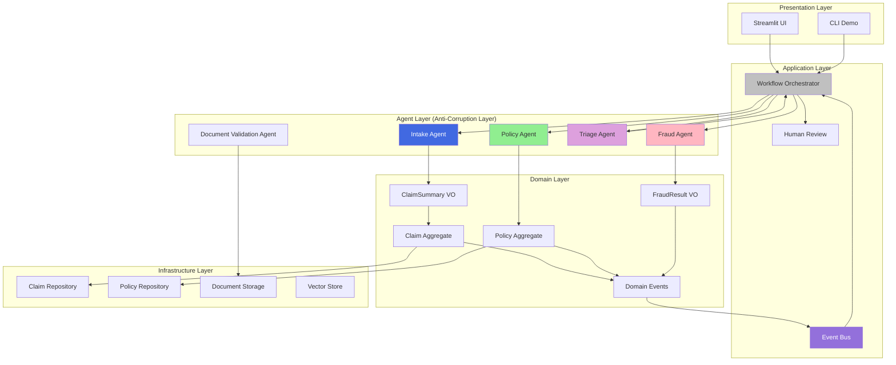
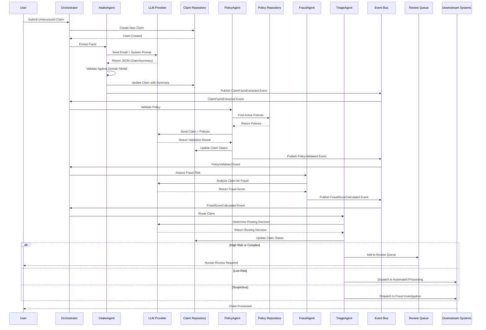
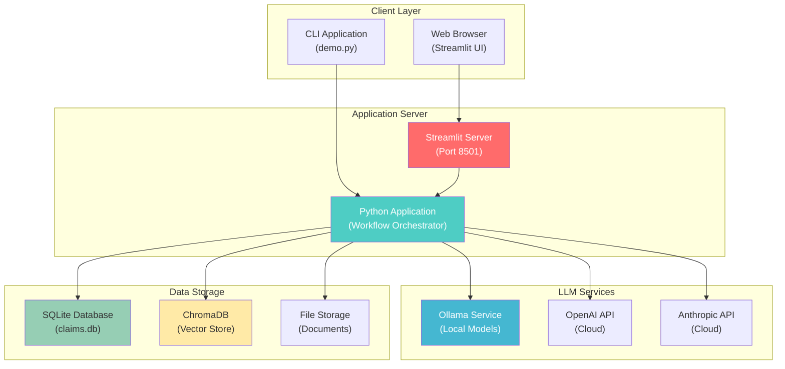
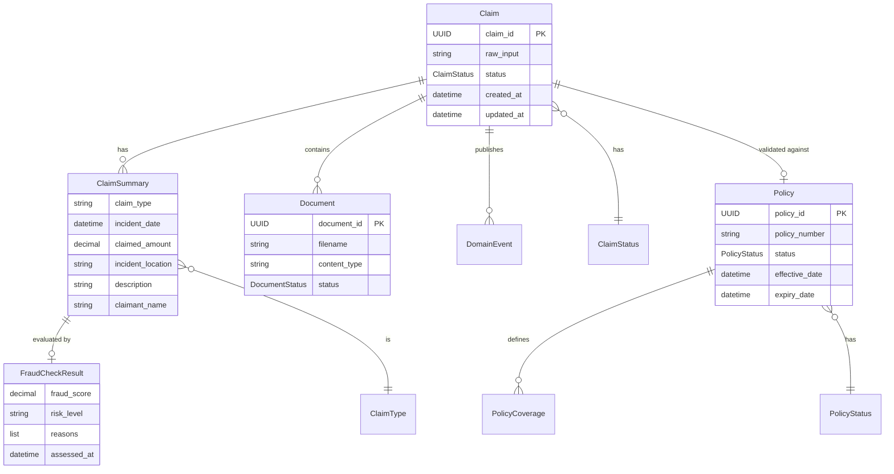

# System Architecture

> **⚠️ IMPORTANT**: This is a **DEMONSTRATION SYSTEM** for **EDUCATIONAL PURPOSES ONLY**.  
> **NOT for production use**. See [DISCLAIMERS.md](../DISCLAIMERS.md) for complete information.

This document visualizes the LLM-Enhanced Claims Processing System using Domain-Driven Design principles (Evans, 2003). All diagrams use Mermaid syntax for GitHub compatibility.

## Table of Contents

- [High-Level Architecture](#high-level-architecture)
- [Component Diagram](#component-diagram)
- [Event Flow Diagram](#event-flow-diagram)
- [Deployment Diagram](#deployment-diagram)
- [Domain Model Diagram](#domain-model-diagram)
- [Architecture Overview](#architecture-overview)
- [DDD Concepts Illustrated](#ddd-concepts-illustrated)
- [Future Work](#future-work)

---

## High-Level Architecture

### The Story This Diagram Tells

Imagine you're looking at an organizational chart for a well-run company. You'd see different departments, each with clear responsibilities, and you'd understand how they work together. This diagram does the same thing for software—it shows how the system is organized into "departments" (bounded contexts), what each department contains, and how they communicate.

**The Journey**: Start at the top with "Unstructured Customer Data"—this is where every claim begins, like a customer dropping off paperwork. Follow the flow down through the Claim Intake department (the Core Domain, shown in blue), where messy input becomes structured information. Notice how domain events (purple triangles) act like inter-office memos, notifying other departments when important things happen. The Workflow Orchestrator (gray box) coordinates everything, like a manager ensuring work flows smoothly between departments.

**Why This Matters**: Understanding this architecture helps you see the big picture. Just like understanding a company's structure helps you know who to contact, understanding this architecture helps you know where functionality lives and how components interact. The separation into bounded contexts (Evans, 2003) keeps the system organized and maintainable.

### Reading the Diagram

1. **Identify the Three Bounded Contexts**: Look for the three main colored boxes—Policy Management (green), Claim Intake (blue), and Fraud Assessment (gray). Each represents a separate "department" with its own rules and responsibilities.

2. **Follow the Flow**: Start with "Unstructured Customer Data" at the top of the Claim Intake context. Follow the arrows to see how data flows: Input → Agent → Service → Value Object → Domain Event.

3. **Notice the Events**: The purple triangles (domain events) are like notifications. When "ClaimFactsExtracted" is published, it triggers the Workflow Orchestrator, which then coordinates the next steps.

4. **See the Coordination**: The Workflow Orchestrator (gray box) doesn't do the work itself—it listens for events and tells the right agents to start. This event-driven approach (Hohpe & Woolf, 2003) keeps components loosely coupled.

This diagram shows the overall system architecture with bounded contexts and key components:

```mermaid
graph TB
    subgraph "Bounded Contexts"
        BC1["Policy Management<br/>(Supporting Domain)"]
        BC2["Claim Intake<br/>(Core Domain)"]
        BC3["Fraud Assessment<br/>(Subdomain)"]
    end
    
    subgraph BC2["Claim Intake - Core Domain"]
        direction TB
        UCD["Unstructured Customer Data<br/>📧 Email/Form/Note"]
        IA["Intake Agent (LLM)<br/>🤖"]
        PE["Prompt Engineering<br/>📝"]
        PR["Policy Repository<br/>💾"]
        PA["Policy (Aggregate)<br/>📋"]
        CFE["ClaimFact Extravice<br/>🛡️"]
        CS["ClaimSummary<br/>(Value Object)<br/>📄"]
        CFE_Event["ClaimFactsExtracted<br/>(Domain Event)<br/>⚡"]
        
        UCD -->|"Unstructured Input"| IA
        PE -->|"System Prompt"| IA
        PR -->|"Policy Data"| PA
        PA -.->|"Reference"| IA
        IA -->|"Extracted Facts"| CFE
        CFE -->|"Structured Summary"| CS
        CFE -->|"Publishes"| CFE_Event
    end
    
    subgraph BC3["Fraud Assessment - Subdomain"]
        direction TB
        FC["FraudCheckResult<br/>📊"]
        ML["ML Fraud Model<br/>🚩"]
        
        CS -->|"Claim Summary"| FC
        FC -->|"Assessment"| ML
    end
    
    subgraph WO["Workflow Orchestrator (Event-Driven)"]
        direction TB
        PV_Event["PolicyValidated<br/>(Domain Event)<br/>⚡"]
        FS_Event["FraudScoreCalculated<br/>(Domain Event)<br/>⚡"]
        PVA["Policy Validation Agent<br/>🔍"]
        TRA1["Triage & Routing Agent<br/>👥"]
        TRA2["Triage & Routing Agent<br/>💻"]
        DS["Downstream Systems<br/>(e.g., Human Adjudicator Queue)<br/>📦"]
        
        CFE_Event -->|"Triggers"| WO
        WO -->|"Publishes"| PV_Event
        WO -->|"Publishes"| FS_Event
        PV_Event -->|"Triggers"| PVA
        PVA -->|"Routes"| TRA1
        FS_Event -->|"Triggers"| TRA2
        TRA1 -->|"Routes"| TRA2
        TRA2 -->|"Dispatches"| DS
    end
    
    style BC1 fill:#90EE90,stroke:#006400,stroke-width:2px
    style BC2 fill:#87CEEB,stroke:#0000CD,stroke-width:2px
    style BC3 fill:#D3D3D3,stroke:#696969,stroke-width:2px
    style CFE fill:#4169E1,stroke:#000080,stroke-width:3px,color:#FFF
    style WO fill:#C0C0C0,stroke:#808080,stroke-width:2px
    style CFE_Event fill:#9370DB,stroke:#4B0082,stroke-width:2px,color:#FFF
    style PV_Event fill:#9370DB,stroke:#4B0082,stroke-width:2px,color:#FFF
    style FS_Event fill:#9370DB,stroke:#4B0082,stroke-width:2px,color:#FFF
```

## Component Diagram

### The Story This Diagram Tells

If the High-Level Architecture diagram shows the "departments," this diagram shows the "organizational layers"—like understanding both the departments and the hierarchy within a company. It shows how components are organized into layers (Presentation, Application, Domain, Agent, Infrastructure) and how they interact.

**The Layers**: Think of this like a building with floors. The top floor (Presentation Layer) is what users see—the Streamlit UI and CLI. The middle floors (Application and Domain Layers) contain the business logic and rules. The bottom floor (Infrastructure Layer) handles technical concerns like storage and databases. The Agent Layer acts as a "translator" between messy external data and the clean domain.

**The Flow**: Notice how requests flow down through layers (from UI to Application to Domain) and how data flows up (from Infrastructure to Domain to Application to UI). The Domain Layer is at the heart—it doesn't depend on infrastructure or presentation, keeping business logic independent of technical concerns.

**Why This Matters**: This layered architecture (Fowler, 2002) separates concerns, making the system easier to understand, test, and maintain. The Domain Layer (the business logic) is independent of how data is stored or how users interact, making it flexible and reusable.

### Reading the Diagram

1. **Identify the Layers**: Start from the top (Presentation) and work down to Infrastructure. Each layer has a specific responsibility.

2. **Follow the Dependencies**: Notice that arrows point downward—upper layers depend on lower layers, but the Domain Layer doesn't depend on Infrastructure. This is the Dependency Inversion Principle in action.

3. **See the Agent Layer**: The Agent Layer (Anti-Corruption Layer) sits between external data and the domain, protecting the clean domain model from messy external input (Evans, 2003).

4. **Notice the Event Bus**: The Event Bus (purple) connects everything, allowing components to communicate through events without direct dependencies.

This diagram shows how major components interact across layers:



## Event Flow Diagram

### The Story This Diagram Tells

This sequence diagram tells the complete story of a claim's journey through the system, step by step, moment by moment. It's like watching a time-lapse video of a package moving through a shipping facility—you see each stop, each person who handles it, and exactly what happens at each stage.

**The Journey**: Follow a claim from the moment a user submits it (top of the diagram) until it reaches downstream systems (bottom). You'll see how the Intake Agent extracts facts, how the Policy Agent validates coverage, how the Fraud Agent assesses risk, and how the Triage Agent makes routing decisions. Each step publishes a domain event that triggers the next step.

**The Communication**: Notice how components don't directly call each other—they communicate through the Event Bus. When the Intake Agent finishes, it publishes "ClaimFactsExtracted," and the Event Bus delivers this to the Orchestrator, which then tells the Policy Agent to start. This event-driven communication (Hohpe & Woolf, 2003) keeps components loosely coupled.

**Why This Matters**: Understanding this flow helps you see dependencies, identify bottlenecks, and understand what happens when something goes wrong. The sequence shows the complete lifecycle, making it easier to trace issues and understand system behavior.

### Reading the Diagram

1. **Read Top to Bottom**: Time flows from top to bottom. Each horizontal line represents a component (User, Orchestrator, Agent, Repository, etc.).

2. **Follow the Arrows**: Arrows show messages or actions. Solid arrows show synchronous calls; dashed arrows show returns or events.

3. **Notice the Events**: Look for "Publish Event" actions—these are domain events that trigger the next steps in the workflow.

4. **See the Alternatives**: The "alt" blocks show different paths a claim can take (high risk vs. low risk, etc.), showing the decision-making process.

This diagram shows how domain events propagate through the system:



## Deployment Diagram

### The Story This Diagram Tells

While other diagrams show logical architecture (how components relate), this diagram shows physical deployment (where components run). It's like the difference between an organizational chart (who reports to whom) and a building floor plan (where people actually sit).

**The Layers**: The diagram shows four main deployment layers: Client Layer (where users interact), Application Server (where the main application runs), LLM Services (where AI models are hosted), and Data Storage (where data is persisted). This separation allows each layer to scale independently.

**The Connections**: Notice how the Application Server connects to multiple LLM services (Ollama for local models, OpenAI and Anthropic for cloud models). This shows the system's flexibility—it can use different AI providers depending on needs and availability.

**Why This Matters**: Understanding deployment helps you see how the system would actually run in practice. The separation into layers allows for flexibility—you could run everything locally with Ollama, use cloud services, or mix both. This is important for understanding scalability, cost, and operational considerations.

### Reading the Diagram

1. **Identify the Layers**: Start from the top (Client Layer) and work down to Data Storage. Each layer represents a different deployment concern.

2. **See the Options**: Notice that the Application Server can connect to multiple LLM services—this shows the system's flexibility in choosing AI providers.

3. **Understand the Flow**: Requests flow from Client → Application Server → LLM Services and Data Storage. The Application Server coordinates everything.

This diagram shows how the system would be deployed (for educational purposes):



## Domain Model Diagram

### The Story This Diagram Tells

This Entity-Relationship Diagram (ERD) shows the core domain model—the fundamental concepts and how they relate. It's like a database schema, but more importantly, it shows the business concepts and their relationships. Think of it as a map of the "things" in the system and how they connect.

**The Entities**: The main entities are Claim, Policy, ClaimSummary, FraudCheckResult, and Document. Each represents a core business concept with its own identity and lifecycle.

**The Relationships**: The lines between entities show relationships. For example, a Claim "has" ClaimSummaries (one-to-many), and a ClaimSummary "is evaluated by" a FraudCheckResult (one-to-one). These relationships reflect business rules.

**The Attributes**: Each entity shows its key attributes. For example, a Claim has a claim_id (unique identifier), raw_input, status, and timestamps. These attributes represent the information the system needs to track.

**Why This Matters**: The domain model is the heart of Domain-Driven Design (Evans, 2003). It represents the business concepts in code, making the system understandable to both developers and domain experts. Understanding this model helps you understand what the system is really about.

### Reading the Diagram

1. **Identify the Entities**: Look for the main boxes (Claim, Policy, ClaimSummary, etc.). Each represents a core business concept.

2. **Understand the Relationships**: The lines show relationships. The notation shows cardinality (one-to-one, one-to-many, etc.).

3. **See the Attributes**: Each entity lists its key attributes. These represent the information tracked for each concept.

4. **Notice the Value Objects**: ClaimSummary and FraudCheckResult are value objects (shown with their attributes but no separate identity). They're defined by their attributes, not by an ID.

This diagram shows the core domain entities and their relationships:



## Architecture Overview

### Understanding the Big Picture

Before diving into details, let's understand the overall architecture story. This system is organized around business concepts (Domain-Driven Design, Evans, 2003), not technical layers. The architecture reflects how the business actually works, making it easier to understand and maintain.

**The Three Bounded Contexts**: Like departments in a company, bounded contexts are separate areas with their own rules and language. They communicate through well-defined interfaces, keeping them independent but coordinated.

**The Event-Driven Flow**: Components don't directly call each other—they publish and listen to domain events. This event-driven architecture (Hohpe & Woolf, 2003) keeps components loosely coupled and makes the system flexible.

**The Agent Layer**: AI agents act as "translators" between messy external data and the clean domain model. This Anti-Corruption Layer pattern (Evans, 2003) protects the system from bad data while enabling intelligent processing.

### Bounded Contexts

1. **Policy Management (Supporting Domain)** - Green
   - Manages insurance policies
   - Provides policy validation services to the Core Domain
   - Contains Policy aggregate and Policy Repository

2. **Claim Intake (Core Domain)** - Blue
   - The heart of the business
   - Receives unstructured customer data
   - Extracts structured claim facts using LLM agents
   - Creates Claim aggregates and publishes domain events
   - Contains Claim aggregate, ClaimSummary value object

3. **Fraud Assessment (Subdomain)** - Gray
   - Assesses fraud risk
   - Uses ML models and LLM agents for fraud detection
   - Contains FraudCheckResult value object

### Key Components

#### ClaimFactExtracterService
- **Unstructured Customer Data**: Raw input from customers (emails, forms, notes)
- **Intake Agent (LLM)**: Uses prompt engineering to extract facts
- **Policy Repository**: Stores policy data
- **Policy Aggregate**: Domain model for policies
- **ClaimFact Extravice**: Core service that extracts claim facts
- **ClaimSummary (Value Object)**: Structured representation of claim facts
- **ClaimFactsExtracted (Domain Event)**: Event published when facts are extracted

#### Fraud Assessment
- **FraudCheckResult**: Result of fraud assessment (value object)
- **ML Fraud Model**: Machine learning model for fraud detection
- **Fraud Agent**: LLM agent that analyzes claims for fraud patterns

#### Workflow Orchestrator (Event-Driven)
- **PolicyValidated (Domain Event)**: Published after policy validation
- **FraudScoreCalculated (Domain Event)**: Published after fraud assessment
- **Policy Validation Agent**: Validates claims against policies
- **Triage & Routing Agents**: Route claims to appropriate downstream systems
- **Downstream Systems**: Final destination (e.g., Human Adjudicator Queue)

### Flow: The Complete Journey

Understanding the flow helps you see how all the pieces work together. Here's the complete journey of a claim through the system:

1. **Input**: Unstructured customer data enters the system—like a customer dropping off paperwork at the front desk. This could be an email, form, or note.

2. **Fact Extraction**: The Intake Agent (LLM) reads the unstructured input and extracts key facts—date, location, amount, description. It's like a skilled analyst reading a messy document and pulling out the important information.

3. **Domain Event**: When facts are extracted, the system publishes a `ClaimFactsExtracted` event. This is like sending a memo to notify other departments that the first step is complete.

4. **Orchestration**: The Workflow Orchestrator receives the event and coordinates the next steps. Like a manager, it doesn't do the work itself but ensures everything happens in the right order.

5. **Policy Validation**: The Policy Validation Agent checks whether the claim is covered by an active policy. It's like a policy expert reviewing coverage rules.

6. **Fraud Assessment**: The Fraud Agent assesses the risk of fraud, calculating a score based on patterns and anomalies. This helps determine how the claim should be handled.

7. **Triage**: The Triage & Routing Agents look at all available information (policy status, fraud score, complexity) and decide where the claim should go next—human review, automated processing, fraud investigation, or rejection.

8. **Dispatch**: The claim is sent to downstream systems—the final destination where it will be processed, reviewed, or investigated.

**The Story**: This flow shows how a claim transforms from messy input to structured, routed information. Each step adds value and moves the claim closer to resolution. The event-driven approach means each step can happen independently, making the system flexible and maintainable.

## DDD Concepts Illustrated

- **Bounded Contexts**: Separate domains with clear boundaries (Evans, 2003)
- **Aggregates**: Claim and Policy are aggregate roots with unique identities (Evans, 2003; Vernon, 2013)
- **Value Objects**: ClaimSummary and FraudCheckResult are immutable value objects (Evans, 2003)
- **Domain Events**: ClaimFactsExtracted, PolicyValidated, FraudScoreCalculated (Vernon, 2013)
- **Repositories**: Policy Repository and Claim Repository provide data access abstraction (Evans, 2003; Fowler, 2002)
- **Anti-Corruption Layer**: Agents translate external data into domain models (Evans, 2003)
- **Event-Driven Architecture**: Workflow orchestrated through domain events (Hohpe & Woolf, 2003)

## Future Work

> **Note**: This section outlines potential improvements and extensions for educational purposes. This is a demonstration system and these enhancements would require significant additional development.

### Architecture Enhancements

1. **Event Sourcing**
   - Implement full event sourcing for complete audit trail
   - Store all domain events for replay and debugging
   - Enable time-travel debugging and state reconstruction

2. **CQRS (Command Query Responsibility Segregation)**
   - Separate read and write models for better scalability
   - Optimize read models for different query patterns
   - Implement eventual consistency patterns

3. **Distributed Event Bus**
   - Replace in-memory event bus with distributed messaging (Redis, RabbitMQ, Kafka)
   - Enable horizontal scaling of event handlers
   - Support multiple service instances

4. **API Gateway**
   - Add REST API layer for external integrations
   - Implement GraphQL for flexible queries
   - Add API versioning and rate limiting

### Domain Model Extensions

1. **Additional Bounded Contexts**
   - **Payment Processing**: Handle claim payments and settlements
   - **Customer Management**: Manage customer profiles and history
   - **Notification Service**: Send notifications via email, SMS, etc.
   - **Reporting & Analytics**: Generate reports and analytics

2. **Enhanced Domain Models**
   - **Multi-line Claims**: Support claims with multiple incidents
   - **Claim History**: Track claim modifications and versions
   - **Document Relationships**: Model relationships between documents
   - **Policy Versions**: Support policy versioning and history

3. **Advanced Value Objects**
   - **Money Value Object**: Type-safe monetary values with currency
   - **Address Value Object**: Structured address information
   - **Date Range Value Object**: Time periods and intervals

### Agent Improvements

1. **Multi-Agent Collaboration**
   - Implement agent-to-agent communication
   - Support agent negotiation and consensus
   - Add agent specialization and delegation

2. **Advanced Prompt Engineering**
   - Implement few-shot learning with examples
   - Add chain-of-thought prompting (Wei et al., 2022)
   - Support prompt templates and versioning
   - A/B testing for prompt effectiveness

3. **Agent Monitoring & Observability**
   - Track agent performance metrics
   - Monitor LLM token usage and costs
   - Implement agent health checks
   - Add agent decision logging

### Infrastructure Enhancements

1. **Persistence Layer**
   - Replace in-memory storage with PostgreSQL or MongoDB
   - Implement database migrations
   - Add connection pooling and transaction management
   - Support database replication

2. **Caching Layer**
   - Add Redis for caching frequently accessed data
   - Cache policy lookups and fraud patterns
   - Implement cache invalidation strategies

3. **Search & Indexing**
   - Enhance vector store with full-text search
   - Add Elasticsearch for advanced search capabilities
   - Implement semantic search across claims

4. **File Storage**
   - Integrate with cloud storage (S3, Azure Blob, GCS)
   - Support large file uploads
   - Implement document versioning

### Security & Compliance

1. **Authentication & Authorization**
   - Implement OAuth2/JWT authentication
   - Add role-based access control (RBAC)
   - Support multi-factor authentication

2. **Data Protection**
   - Encrypt sensitive data at rest and in transit
   - Implement data masking for PII
   - Add audit logging for compliance

3. **Compliance Features**
   - HIPAA compliance for health insurance claims
   - GDPR compliance for EU customers
   - SOC 2 compliance for enterprise use
   - Regulatory reporting capabilities

### Testing & Quality

1. **Test Coverage**
   - Increase unit test coverage to >90%
   - Add integration tests for all workflows
   - Implement property-based testing
   - Add performance and load testing

2. **Quality Assurance**
   - Implement continuous integration (CI/CD)
   - Add code quality gates (SonarQube, CodeClimate)
   - Automated security scanning
   - Dependency vulnerability scanning

### Monitoring & Observability

1. **Application Monitoring**
   - Add distributed tracing (Jaeger, Zipkin)
   - Implement structured logging
   - Add metrics collection (Prometheus)
   - Create dashboards (Grafana)

2. **Business Metrics**
   - Track claim processing times
   - Monitor fraud detection accuracy
   - Measure agent performance
   - Track human review patterns

### User Experience

1. **Enhanced UI**
   - Improve Streamlit dashboard with better UX
   - Add real-time updates via WebSockets
   - Implement dark mode
   - Add accessibility features (WCAG compliance)

2. **Mobile Support**
   - Create mobile-responsive web interface
   - Develop native mobile apps
   - Support offline mode

### Research & Experimentation

1. **LLM Research**
   - Experiment with different LLM models
   - Compare prompt engineering techniques
   - Research fine-tuning for domain-specific tasks
   - Evaluate cost vs. quality trade-offs

2. **Architecture Patterns**
   - Experiment with different DDD patterns
   - Test microservices vs. modular monolith
   - Evaluate event sourcing implementations
   - Research CQRS patterns

### Documentation & Education

1. **Enhanced Documentation**
   - Add video tutorials
   - Create interactive code walkthroughs
   - Add more architecture decision records (ADRs)
   - Expand example scenarios

2. **Educational Resources**
   - Create course materials
   - Add exercises and assignments
   - Develop assessment rubrics
   - Create certification program

---

**Note**: These future enhancements are suggestions for educational exploration. For production use, a complete rewrite would be necessary with proper security, compliance, and production-grade infrastructure. See [DISCLAIMERS.md](../DISCLAIMERS.md) for more information.

---

For more information, see:
- [Technical Documentation](TECHNICAL.md) - Detailed architecture decisions
- [Sequence Diagram](sequence_diagram.md) - Workflow sequence details
- [References](REFERENCES.md) - Research citations and resources
