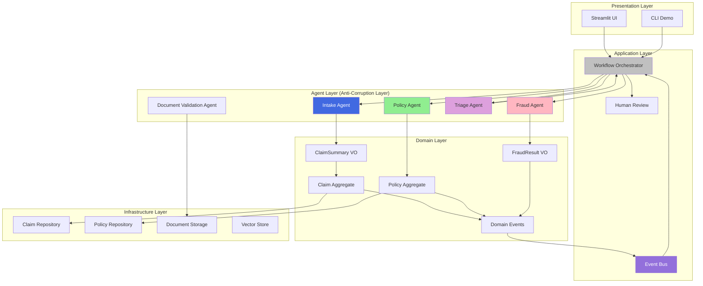
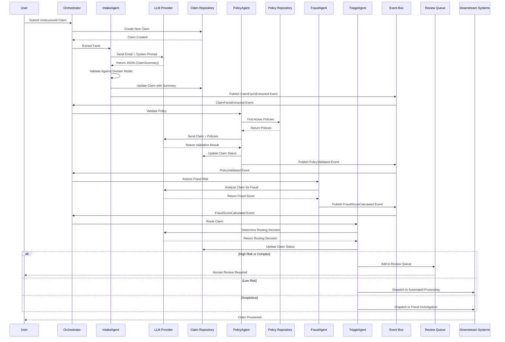
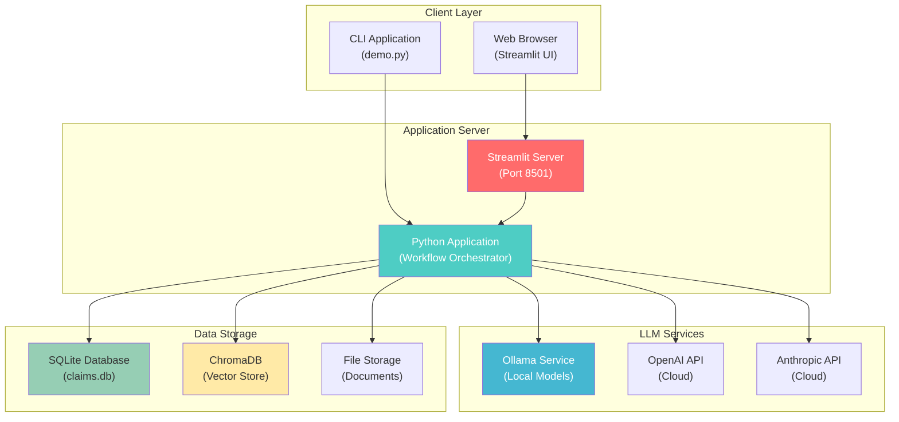
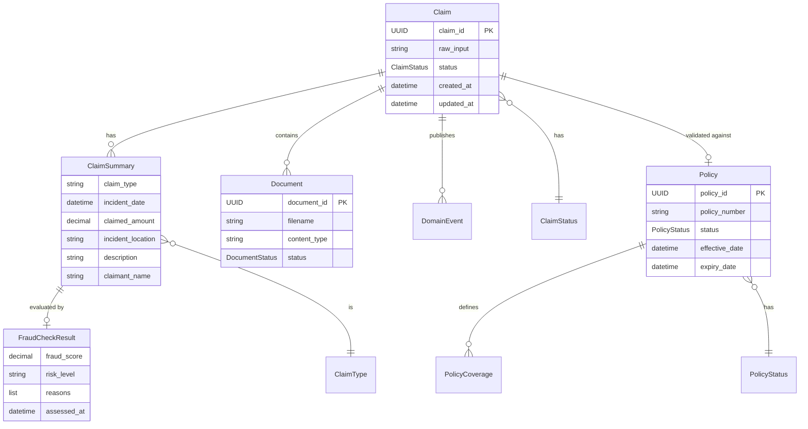

# System Architecture

> **⚠️ IMPORTANT**: This is a **DEMONSTRATION SYSTEM** for **EDUCATIONAL PURPOSES ONLY**.  
> **NOT for production use**. See [DISCLAIMERS.md](../DISCLAIMERS.md) for complete information.

This document visualizes the LLM-Enhanced Claims Processing System using Domain-Driven Design principles (Evans, 2003). All diagrams use Mermaid syntax for GitHub compatibility.

## Table of Contents

- [High-Level Architecture](#high-level-architecture)
- [Component Diagram](#component-diagram)
- [Event Flow Diagram](#event-flow-diagram)
- [Deployment Diagram](#deployment-diagram)
- [Domain Model Diagram](#domain-model-diagram)
- [Architecture Overview](#architecture-overview)
- [DDD Concepts Illustrated](#ddd-concepts-illustrated)
- [Future Work](#future-work)

---

## High-Level Architecture

This diagram shows the overall system architecture with bounded contexts and key components:

```mermaid
graph TB
    subgraph "Bounded Contexts"
        BC1["Policy Management<br/>(Supporting Domain)"]
        BC2["Claim Intake<br/>(Core Domain)"]
        BC3["Fraud Assessment<br/>(Subdomain)"]
    end
    
    subgraph BC2["Claim Intake - Core Domain"]
        direction TB
        UCD["Unstructured Customer Data<br/>📧 Email/Form/Note"]
        IA["Intake Agent (LLM)<br/>🤖"]
        PE["Prompt Engineering<br/>📝"]
        PR["Policy Repository<br/>💾"]
        PA["Policy (Aggregate)<br/>📋"]
        CFE["ClaimFact Extravice<br/>🛡️"]
        CS["ClaimSummary<br/>(Value Object)<br/>📄"]
        CFE_Event["ClaimFactsExtracted<br/>(Domain Event)<br/>⚡"]
        
        UCD -->|"Unstructured Input"| IA
        PE -->|"System Prompt"| IA
        PR -->|"Policy Data"| PA
        PA -.->|"Reference"| IA
        IA -->|"Extracted Facts"| CFE
        CFE -->|"Structured Summary"| CS
        CFE -->|"Publishes"| CFE_Event
    end
    
    subgraph BC3["Fraud Assessment - Subdomain"]
        direction TB
        FC["FraudCheckResult<br/>📊"]
        ML["ML Fraud Model<br/>🚩"]
        
        CS -->|"Claim Summary"| FC
        FC -->|"Assessment"| ML
    end
    
    subgraph WO["Workflow Orchestrator (Event-Driven)"]
        direction TB
        PV_Event["PolicyValidated<br/>(Domain Event)<br/>⚡"]
        FS_Event["FraudScoreCalculated<br/>(Domain Event)<br/>⚡"]
        PVA["Policy Validation Agent<br/>🔍"]
        TRA1["Triage & Routing Agent<br/>👥"]
        TRA2["Triage & Routing Agent<br/>💻"]
        DS["Downstream Systems<br/>(e.g., Human Adjudicator Queue)<br/>📦"]
        
        CFE_Event -->|"Triggers"| WO
        WO -->|"Publishes"| PV_Event
        WO -->|"Publishes"| FS_Event
        PV_Event -->|"Triggers"| PVA
        PVA -->|"Routes"| TRA1
        FS_Event -->|"Triggers"| TRA2
        TRA1 -->|"Routes"| TRA2
        TRA2 -->|"Dispatches"| DS
    end
    
    style BC1 fill:#90EE90,stroke:#006400,stroke-width:2px
    style BC2 fill:#87CEEB,stroke:#0000CD,stroke-width:2px
    style BC3 fill:#D3D3D3,stroke:#696969,stroke-width:2px
    style CFE fill:#4169E1,stroke:#000080,stroke-width:3px,color:#FFF
    style WO fill:#C0C0C0,stroke:#808080,stroke-width:2px
    style CFE_Event fill:#9370DB,stroke:#4B0082,stroke-width:2px,color:#FFF
    style PV_Event fill:#9370DB,stroke:#4B0082,stroke-width:2px,color:#FFF
    style FS_Event fill:#9370DB,stroke:#4B0082,stroke-width:2px,color:#FFF
```

## Component Diagram

This diagram shows how major components interact across layers:



## Event Flow Diagram

This diagram shows how domain events propagate through the system:



## Deployment Diagram

This diagram shows how the system would be deployed (for educational purposes):



## Domain Model Diagram

This diagram shows the core domain entities and their relationships:



## Architecture Overview

### Bounded Contexts

1. **Policy Management (Supporting Domain)** - Green
   - Manages insurance policies
   - Provides policy validation services to the Core Domain
   - Contains Policy aggregate and Policy Repository

2. **Claim Intake (Core Domain)** - Blue
   - The heart of the business
   - Receives unstructured customer data
   - Extracts structured claim facts using LLM agents
   - Creates Claim aggregates and publishes domain events
   - Contains Claim aggregate, ClaimSummary value object

3. **Fraud Assessment (Subdomain)** - Gray
   - Assesses fraud risk
   - Uses ML models and LLM agents for fraud detection
   - Contains FraudCheckResult value object

### Key Components

#### ClaimFactExtracterService
- **Unstructured Customer Data**: Raw input from customers (emails, forms, notes)
- **Intake Agent (LLM)**: Uses prompt engineering to extract facts
- **Policy Repository**: Stores policy data
- **Policy Aggregate**: Domain model for policies
- **ClaimFact Extravice**: Core service that extracts claim facts
- **ClaimSummary (Value Object)**: Structured representation of claim facts
- **ClaimFactsExtracted (Domain Event)**: Event published when facts are extracted

#### Fraud Assessment
- **FraudCheckResult**: Result of fraud assessment (value object)
- **ML Fraud Model**: Machine learning model for fraud detection
- **Fraud Agent**: LLM agent that analyzes claims for fraud patterns

#### Workflow Orchestrator (Event-Driven)
- **PolicyValidated (Domain Event)**: Published after policy validation
- **FraudScoreCalculated (Domain Event)**: Published after fraud assessment
- **Policy Validation Agent**: Validates claims against policies
- **Triage & Routing Agents**: Route claims to appropriate downstream systems
- **Downstream Systems**: Final destination (e.g., Human Adjudicator Queue)

### Flow

1. **Input**: Unstructured customer data enters the system
2. **Fact Extraction**: Intake Agent (LLM) extracts structured facts
3. **Domain Event**: ClaimFactsExtracted event is published
4. **Orchestration**: Workflow Orchestrator receives the event
5. **Policy Validation**: Policy Validation Agent checks coverage
6. **Fraud Assessment**: Fraud score is calculated
7. **Triage**: Triage & Routing Agents determine routing
8. **Dispatch**: Claim is sent to downstream systems

## DDD Concepts Illustrated

- **Bounded Contexts**: Separate domains with clear boundaries (Evans, 2003)
- **Aggregates**: Claim and Policy are aggregate roots with unique identities (Evans, 2003; Vernon, 2013)
- **Value Objects**: ClaimSummary and FraudCheckResult are immutable value objects (Evans, 2003)
- **Domain Events**: ClaimFactsExtracted, PolicyValidated, FraudScoreCalculated (Vernon, 2013)
- **Repositories**: Policy Repository and Claim Repository provide data access abstraction (Evans, 2003; Fowler, 2002)
- **Anti-Corruption Layer**: Agents translate external data into domain models (Evans, 2003)
- **Event-Driven Architecture**: Workflow orchestrated through domain events (Hohpe & Woolf, 2003)

## Future Work

> **Note**: This section outlines potential improvements and extensions for educational purposes. This is a demonstration system and these enhancements would require significant additional development.

### Architecture Enhancements

1. **Event Sourcing**
   - Implement full event sourcing for complete audit trail
   - Store all domain events for replay and debugging
   - Enable time-travel debugging and state reconstruction

2. **CQRS (Command Query Responsibility Segregation)**
   - Separate read and write models for better scalability
   - Optimize read models for different query patterns
   - Implement eventual consistency patterns

3. **Distributed Event Bus**
   - Replace in-memory event bus with distributed messaging (Redis, RabbitMQ, Kafka)
   - Enable horizontal scaling of event handlers
   - Support multiple service instances

4. **API Gateway**
   - Add REST API layer for external integrations
   - Implement GraphQL for flexible queries
   - Add API versioning and rate limiting

### Domain Model Extensions

1. **Additional Bounded Contexts**
   - **Payment Processing**: Handle claim payments and settlements
   - **Customer Management**: Manage customer profiles and history
   - **Notification Service**: Send notifications via email, SMS, etc.
   - **Reporting & Analytics**: Generate reports and analytics

2. **Enhanced Domain Models**
   - **Multi-line Claims**: Support claims with multiple incidents
   - **Claim History**: Track claim modifications and versions
   - **Document Relationships**: Model relationships between documents
   - **Policy Versions**: Support policy versioning and history

3. **Advanced Value Objects**
   - **Money Value Object**: Type-safe monetary values with currency
   - **Address Value Object**: Structured address information
   - **Date Range Value Object**: Time periods and intervals

### Agent Improvements

1. **Multi-Agent Collaboration**
   - Implement agent-to-agent communication
   - Support agent negotiation and consensus
   - Add agent specialization and delegation

2. **Advanced Prompt Engineering**
   - Implement few-shot learning with examples
   - Add chain-of-thought prompting (Wei et al., 2022)
   - Support prompt templates and versioning
   - A/B testing for prompt effectiveness

3. **Agent Monitoring & Observability**
   - Track agent performance metrics
   - Monitor LLM token usage and costs
   - Implement agent health checks
   - Add agent decision logging

### Infrastructure Enhancements

1. **Persistence Layer**
   - Replace in-memory storage with PostgreSQL or MongoDB
   - Implement database migrations
   - Add connection pooling and transaction management
   - Support database replication

2. **Caching Layer**
   - Add Redis for caching frequently accessed data
   - Cache policy lookups and fraud patterns
   - Implement cache invalidation strategies

3. **Search & Indexing**
   - Enhance vector store with full-text search
   - Add Elasticsearch for advanced search capabilities
   - Implement semantic search across claims

4. **File Storage**
   - Integrate with cloud storage (S3, Azure Blob, GCS)
   - Support large file uploads
   - Implement document versioning

### Security & Compliance

1. **Authentication & Authorization**
   - Implement OAuth2/JWT authentication
   - Add role-based access control (RBAC)
   - Support multi-factor authentication

2. **Data Protection**
   - Encrypt sensitive data at rest and in transit
   - Implement data masking for PII
   - Add audit logging for compliance

3. **Compliance Features**
   - HIPAA compliance for health insurance claims
   - GDPR compliance for EU customers
   - SOC 2 compliance for enterprise use
   - Regulatory reporting capabilities

### Testing & Quality

1. **Test Coverage**
   - Increase unit test coverage to >90%
   - Add integration tests for all workflows
   - Implement property-based testing
   - Add performance and load testing

2. **Quality Assurance**
   - Implement continuous integration (CI/CD)
   - Add code quality gates (SonarQube, CodeClimate)
   - Automated security scanning
   - Dependency vulnerability scanning

### Monitoring & Observability

1. **Application Monitoring**
   - Add distributed tracing (Jaeger, Zipkin)
   - Implement structured logging
   - Add metrics collection (Prometheus)
   - Create dashboards (Grafana)

2. **Business Metrics**
   - Track claim processing times
   - Monitor fraud detection accuracy
   - Measure agent performance
   - Track human review patterns

### User Experience

1. **Enhanced UI**
   - Improve Streamlit dashboard with better UX
   - Add real-time updates via WebSockets
   - Implement dark mode
   - Add accessibility features (WCAG compliance)

2. **Mobile Support**
   - Create mobile-responsive web interface
   - Develop native mobile apps
   - Support offline mode

### Research & Experimentation

1. **LLM Research**
   - Experiment with different LLM models
   - Compare prompt engineering techniques
   - Research fine-tuning for domain-specific tasks
   - Evaluate cost vs. quality trade-offs

2. **Architecture Patterns**
   - Experiment with different DDD patterns
   - Test microservices vs. modular monolith
   - Evaluate event sourcing implementations
   - Research CQRS patterns

### Documentation & Education

1. **Enhanced Documentation**
   - Add video tutorials
   - Create interactive code walkthroughs
   - Add more architecture decision records (ADRs)
   - Expand example scenarios

2. **Educational Resources**
   - Create course materials
   - Add exercises and assignments
   - Develop assessment rubrics
   - Create certification program

---

**Note**: These future enhancements are suggestions for educational exploration. For production use, a complete rewrite would be necessary with proper security, compliance, and production-grade infrastructure. See [DISCLAIMERS.md](../DISCLAIMERS.md) for more information.

---

For more information, see:
- [Technical Documentation](TECHNICAL.md) - Detailed architecture decisions
- [Sequence Diagram](sequence_diagram.md) - Workflow sequence details
- [References](REFERENCES.md) - Research citations and resources
