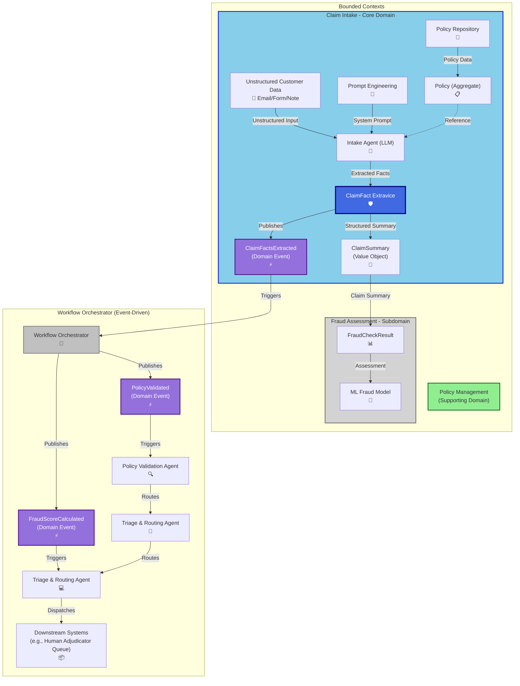
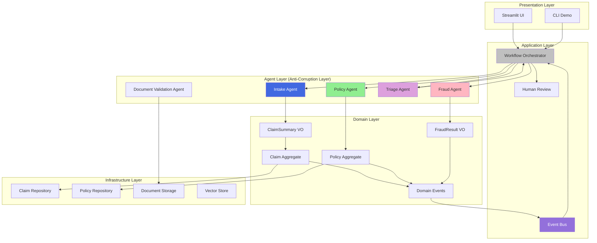
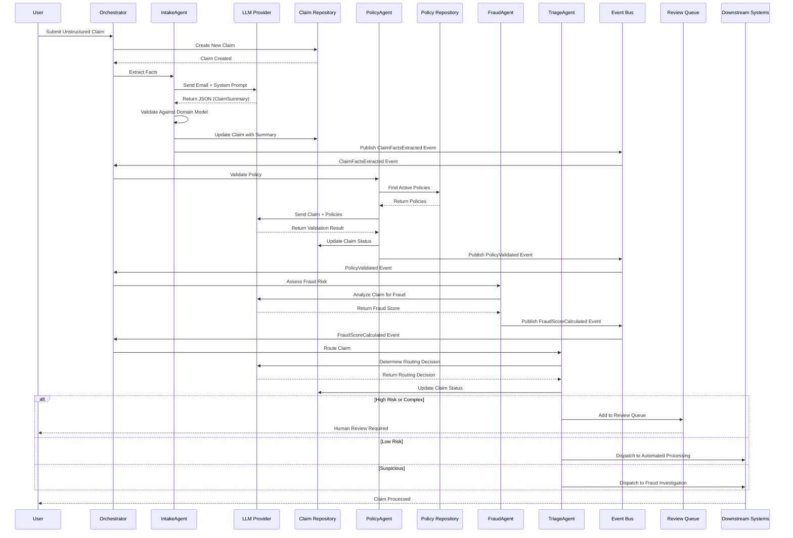
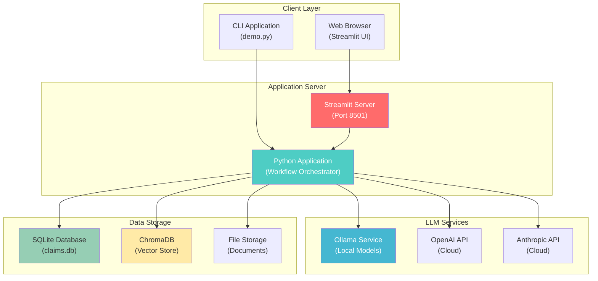
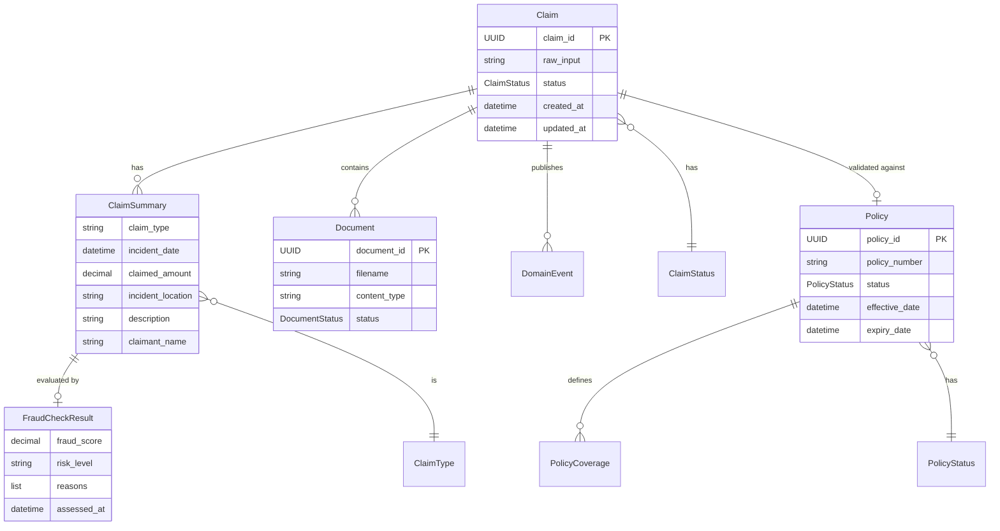

# System Architecture

> **⚠️ IMPORTANT**: This is a **DEMONSTRATION SYSTEM** for **EDUCATIONAL PURPOSES ONLY**.  
> **NOT for production use**. See [DISCLAIMERS.md](../DISCLAIMERS.md) for complete information.

This document visualizes the LLM-Enhanced Claims Processing System using Domain-Driven Design principles (Evans, 2003). All diagrams use Mermaid syntax for GitHub compatibility.

## Table of Contents

- [High-Level Architecture](#high-level-architecture)
- [Component Diagram](#component-diagram)
- [Event Flow Diagram](#event-flow-diagram)
- [Deployment Diagram](#deployment-diagram)
- [Domain Model Diagram](#domain-model-diagram)
- [Architecture Overview](#architecture-overview)
- [DDD Concepts Illustrated](#ddd-concepts-illustrated)
- [Future Work](#future-work)

---

## High-Level Architecture

### Architecture Overview

This diagram illustrates the system's organizational structure through bounded contexts (Evans, 2003), analogous to organizational units with distinct responsibilities and interfaces. Each bounded context encapsulates related domain logic, data models, and business rules, communicating through well-defined boundaries.

**System Flow**: The workflow initiates with unstructured customer data at the entry point. Data flows through the Claim Intake bounded context (Core Domain, highlighted in blue), where unstructured input undergoes transformation into structured domain models. Domain events (represented by purple triangles) serve as asynchronous notifications, enabling loose coupling between bounded contexts. The Workflow Orchestrator (gray box) coordinates cross-context interactions, managing the event-driven workflow orchestration.

**Architectural Significance**: This bounded context separation (Evans, 2003) provides clear functional boundaries, enabling independent evolution of domain logic while maintaining system coherence. Understanding this structure facilitates component location, dependency management, and system maintenance.

### Reading the Diagram

1. **Identify the Three Bounded Contexts**: Look for the three main colored boxes—Policy Management (green), Claim Intake (blue), and Fraud Assessment (gray). Each represents a separate "department" with its own rules and responsibilities.

2. **Follow the Flow**: Start with "Unstructured Customer Data" at the top of the Claim Intake context. Follow the arrows to see how data flows: Input → Agent → Service → Value Object → Domain Event.

3. **Notice the Events**: The purple triangles (domain events) are like notifications. When "ClaimFactsExtracted" is published, it triggers the Workflow Orchestrator, which then coordinates the next steps.

4. **See the Coordination**: The Workflow Orchestrator (gray box) doesn't do the work itself—it listens for events and tells the right agents to start. This event-driven approach (Hohpe & Woolf, 2003) keeps components loosely coupled.

This diagram shows the overall system architecture with bounded contexts and key components:



## Component Diagram

### Component Architecture

This diagram presents the layered architecture, illustrating how components are organized across architectural layers (Presentation, Application, Domain, Agent, Infrastructure) and their interaction patterns.

**Layer Organization**: The architecture follows a layered structure where each layer has distinct responsibilities. The Presentation Layer provides user interfaces (Streamlit UI and CLI). The Application and Domain Layers contain business logic and domain rules. The Infrastructure Layer handles technical concerns including storage and database operations. The Agent Layer functions as an Anti-Corruption Layer (Evans, 2003), translating external data formats into domain models.

**Data Flow**: Requests flow downward through layers (Presentation → Application → Domain), while data flows upward (Infrastructure → Domain → Application → Presentation). The Domain Layer maintains independence from infrastructure and presentation concerns, preserving business logic purity.

**Architectural Benefits**: This layered architecture (Fowler, 2002) enforces separation of concerns, improving system understandability, testability, and maintainability. Domain logic independence from technical infrastructure enables flexibility and reusability.

### Reading the Diagram

1. **Identify the Layers**: Start from the top (Presentation) and work down to Infrastructure. Each layer has a specific responsibility.

2. **Follow the Dependencies**: Notice that arrows point downward—upper layers depend on lower layers, but the Domain Layer doesn't depend on Infrastructure. This is the Dependency Inversion Principle in action.

3. **See the Agent Layer**: The Agent Layer (Anti-Corruption Layer) sits between external data and the domain, protecting the clean domain model from messy external input (Evans, 2003).

4. **Notice the Event Bus**: The Event Bus (purple) connects everything, allowing components to communicate through events without direct dependencies.

This diagram shows how major components interact across layers:



## Event Flow Diagram

### Workflow Sequence

This sequence diagram documents the complete claim processing workflow, illustrating temporal ordering of interactions between system components throughout the claim lifecycle.

**Processing Flow**: The sequence begins with claim submission and proceeds through fact extraction, policy validation, fraud assessment, and routing decisions. Each processing stage publishes domain events that trigger subsequent workflow steps, enabling event-driven coordination (Hohpe & Woolf, 2003).

**Event-Driven Communication**: Components interact asynchronously through the Event Bus rather than direct method calls. When the Intake Agent completes fact extraction, it publishes a `ClaimFactsExtracted` event. The Event Bus delivers this event to the Orchestrator, which then initiates the Policy Agent. This pattern maintains loose coupling between components (Hohpe & Woolf, 2003).

**Operational Value**: Understanding this sequence enables dependency analysis, bottleneck identification, and failure mode analysis. The complete lifecycle representation facilitates issue tracing and system behavior comprehension.

### Reading the Diagram

1. **Read Top to Bottom**: Time flows from top to bottom. Each horizontal line represents a component (User, Orchestrator, Agent, Repository, etc.).

2. **Follow the Arrows**: Arrows show messages or actions. Solid arrows show synchronous calls; dashed arrows show returns or events.

3. **Notice the Events**: Look for "Publish Event" actions—these are domain events that trigger the next steps in the workflow.

4. **See the Alternatives**: The "alt" blocks show different paths a claim can take (high risk vs. low risk, etc.), showing the decision-making process.

This diagram shows how domain events propagate through the system:



## Deployment Diagram

### Deployment Architecture

This diagram presents the physical deployment topology, distinguishing logical architecture from deployment infrastructure. It illustrates component placement across deployment layers and their network connectivity.

**Deployment Layers**: The architecture comprises four deployment layers: Client Layer (user interaction endpoints), Application Server (core application runtime), LLM Services (AI model hosting infrastructure), and Data Storage (persistence layer). This separation enables independent scaling and deployment of each layer.

**Service Integration**: The Application Server integrates with multiple LLM service providers (Ollama for local models, OpenAI and Anthropic for cloud-based models), demonstrating provider abstraction and deployment flexibility. This design supports hybrid deployment strategies based on requirements, availability, and cost considerations.

**Deployment Considerations**: Understanding the deployment architecture informs operational decisions regarding scalability, cost optimization, and infrastructure requirements. The layered separation supports flexible deployment strategies, from fully local (Ollama) to fully cloud-based or hybrid configurations.

### Reading the Diagram

1. **Identify the Layers**: Start from the top (Client Layer) and work down to Data Storage. Each layer represents a different deployment concern.

2. **See the Options**: Notice that the Application Server can connect to multiple LLM services—this shows the system's flexibility in choosing AI providers.

3. **Understand the Flow**: Requests flow from Client → Application Server → LLM Services and Data Storage. The Application Server coordinates everything.

This diagram shows how the system would be deployed (for educational purposes):



## Domain Model Diagram

### Domain Model

This Entity-Relationship Diagram (ERD) represents the core domain model, defining fundamental business concepts and their relationships. While structurally similar to a database schema, the domain model emphasizes business semantics over technical implementation.

**Core Entities**: The primary entities include Claim, Policy, ClaimSummary, FraudCheckResult, and Document. Each entity represents a distinct business concept with unique identity and lifecycle management.

**Entity Relationships**: Relationship lines indicate associations between entities. For example, Claim maintains a one-to-many relationship with ClaimSummary, while ClaimSummary has a one-to-one relationship with FraudCheckResult. These relationships encode business rules and domain constraints.

**Entity Attributes**: Each entity includes key attributes defining its structure. For instance, Claim includes claim_id (unique identifier), raw_input, status, and temporal attributes (created_at, updated_at). These attributes capture the information necessary for business operations.

**Domain Model Significance**: The domain model serves as the foundation of Domain-Driven Design (Evans, 2003), representing business concepts in code. This representation enables shared understanding between developers and domain experts, making the system's purpose and structure explicit.

### Reading the Diagram

1. **Identify the Entities**: Look for the main boxes (Claim, Policy, ClaimSummary, etc.). Each represents a core business concept.

2. **Understand the Relationships**: The lines show relationships. The notation shows cardinality (one-to-one, one-to-many, etc.).

3. **See the Attributes**: Each entity lists its key attributes. These represent the information tracked for each concept.

4. **Notice the Value Objects**: ClaimSummary and FraudCheckResult are value objects (shown with their attributes but no separate identity). They're defined by their attributes, not by an ID.

This diagram shows the core domain entities and their relationships:



## Architecture Overview

### Understanding the Big Picture

Before diving into details, let's understand the overall architecture story. This system is organized around business concepts (Domain-Driven Design, Evans, 2003), not technical layers. The architecture reflects how the business actually works, making it easier to understand and maintain.

**The Three Bounded Contexts**: Like departments in a company, bounded contexts are separate areas with their own rules and language. They communicate through well-defined interfaces, keeping them independent but coordinated.

**Why Three Contexts?** We separated the system into three bounded contexts because each has different:
- **Rules**: Claim processing rules differ from policy rules
- **Change Rates**: Fraud detection algorithms change more frequently than policy structures
- **Ownership**: Different teams might own different contexts
- **Language**: Each context has its own domain terminology

This separation prevents changes in one context from breaking another, making the system more maintainable (Evans, 2003, pp. 335-365).

**The Event-Driven Flow**: Components don't directly call each other—they publish and listen to domain events. This event-driven architecture (Hohpe & Woolf, 2003) keeps components loosely coupled and makes the system flexible.

**Why Events Instead of Direct Calls?** We chose events because:
- **Loose Coupling**: Components don't need to know about each other directly
- **Scalability**: Events can be processed asynchronously and in parallel
- **Extensibility**: New features can listen to events without modifying existing code
- **Resilience**: If one component fails, others continue processing
- **Auditability**: Events provide a complete history of system behavior

This makes the system easier to test, modify, and scale (Hohpe & Woolf, 2003, pp. 516-530).

**The Agent Layer**: AI agents act as "translators" between messy external data and the clean domain model. This Anti-Corruption Layer pattern (Evans, 2003) protects the system from bad data while enabling intelligent processing.

**Why Agents as Anti-Corruption Layer?** We use agents as an Anti-Corruption Layer because:
- **Data Quality**: LLM outputs are unpredictable—agents validate and transform data before it enters the domain
- **Domain Protection**: The clean domain model stays protected from external system changes
- **Validation**: Agents enforce business rules at the boundary, preventing invalid data from entering the system
- **Abstraction**: Domain code doesn't need to know about LLM APIs, prompts, or provider-specific details

This pattern is especially important with AI systems where outputs can vary significantly (Evans, 2003, pp. 365-380).

### Bounded Contexts

1. **Policy Management (Supporting Domain)** - Green
   - Manages insurance policies
   - Provides policy validation services to the Core Domain
   - Contains Policy aggregate and Policy Repository

2. **Claim Intake (Core Domain)** - Blue
   - The heart of the business
   - Receives unstructured customer data
   - Extracts structured claim facts using LLM agents
   - Creates Claim aggregates and publishes domain events
   - Contains Claim aggregate, ClaimSummary value object

3. **Fraud Assessment (Subdomain)** - Gray
   - Assesses fraud risk
   - Uses ML models and LLM agents for fraud detection
   - Contains FraudCheckResult value object

### Key Components

#### ClaimFactExtracterService
- **Unstructured Customer Data**: Raw input from customers (emails, forms, notes)
- **Intake Agent (LLM)**: Uses prompt engineering to extract facts
- **Policy Repository**: Stores policy data
- **Policy Aggregate**: Domain model for policies
- **ClaimFact Extravice**: Core service that extracts claim facts
- **ClaimSummary (Value Object)**: Structured representation of claim facts
- **ClaimFactsExtracted (Domain Event)**: Event published when facts are extracted

#### Fraud Assessment
- **FraudCheckResult**: Result of fraud assessment (value object)
- **ML Fraud Model**: Machine learning model for fraud detection
- **Fraud Agent**: LLM agent that analyzes claims for fraud patterns

#### Workflow Orchestrator (Event-Driven)
- **PolicyValidated (Domain Event)**: Published after policy validation
- **FraudScoreCalculated (Domain Event)**: Published after fraud assessment
- **Policy Validation Agent**: Validates claims against policies
- **Triage & Routing Agents**: Route claims to appropriate downstream systems
- **Downstream Systems**: Final destination (e.g., Human Adjudicator Queue)

### Complete Workflow Process

The workflow process illustrates how system components coordinate to transform unstructured input into processed, routed claims. The following sequence describes the complete processing pipeline:

1. **Input Reception**: Unstructured customer data enters the system through various channels (email, form submissions, notes). This input requires transformation into structured domain models.

2. **Fact Extraction**: The Intake Agent (LLM-based) processes unstructured input to extract structured facts: incident date, location, claimed amount, description, and other relevant attributes. The agent applies prompt engineering techniques (Brown et al., 2020; Ouyang et al., 2022) to perform this extraction.

3. **Domain Event Publication**: Upon successful fact extraction, the system publishes a `ClaimFactsExtracted` domain event. This event signals completion of the extraction phase and triggers downstream processing.

4. **Workflow Orchestration**: The Workflow Orchestrator receives domain events and coordinates subsequent processing steps. It manages workflow state and ensures proper sequencing of operations without implementing business logic directly.

5. **Policy Validation**: The Policy Validation Agent evaluates whether the claim is covered by an active policy. This validation ensures compliance with policy terms and coverage rules.

6. **Fraud Assessment**: The Fraud Agent analyzes claim patterns and anomalies to calculate a fraud risk score. This assessment informs routing decisions and risk management strategies.

7. **Triage and Routing**: The Triage Agent evaluates all available information (policy validation status, fraud score, claim complexity) to determine appropriate routing: human review queue, automated processing, fraud investigation, or rejection.

8. **Downstream Dispatch**: The claim is dispatched to the appropriate downstream system for final processing, review, or investigation.

**Workflow Characteristics**: This process transforms unstructured input into structured, validated, and routed information. Each stage adds value through domain-specific processing. The event-driven architecture enables independent execution of stages, improving system flexibility and maintainability (Hohpe & Woolf, 2003).

## Downstream Systems: Integration and Routing

### What Are Downstream Systems?

**Downstream Systems** represent the final destinations where processed claims are dispatched after the triage and routing decision. These are external systems, queues, or services that handle the actual claim processing, review, investigation, or rejection. In a production insurance environment, these would be separate systems with their own responsibilities and lifecycles.

**Why They Matter**: Understanding downstream systems is crucial because they represent the boundary between our DDD-based claims processing system and the rest of the insurance ecosystem. The integration patterns used here demonstrate how to maintain bounded context boundaries while enabling system integration (Evans, 2003; Hohpe & Woolf, 2003).

### Types of Downstream Systems

Based on the routing decisions made by the Triage Agent, claims are dispatched to different types of downstream systems:

#### 1. Human Adjudicator Queue

**Purpose**: For complex claims requiring human judgment, high-value claims, or cases where automated processing is insufficient.

**Characteristics**:
- **Complexity**: Claims with ambiguous facts, multiple incidents, or unusual circumstances
- **High Value**: Claims exceeding business-defined thresholds (e.g., >$50,000)
- **Policy Ambiguity**: Claims where policy coverage is unclear or requires interpretation
- **Customer Service**: Claims requiring special handling or customer communication

**Integration Pattern**: Message Queue (Hohpe & Woolf, 2003)
- Claims are placed in a priority queue (e.g., RabbitMQ, Amazon SQS, Azure Service Bus)
- Human adjudicators pull claims from the queue based on priority
- Queue supports priority ordering, retry logic, and dead-letter queues
- Integration follows the **Message Queue pattern** (Hohpe & Woolf, 2003, pp. 102-115)

**Example Flow**:
```
Triage Agent → Publish "ClaimRoutedToHumanReview" Event
Event Bus → Human Review Queue Service
Queue Service → Enqueue Claim (with priority)
Human Adjudicator → Dequeue and Review
Adjudicator → Update Claim Status (Approved/Rejected/NeedsMoreInfo)
```

**Why This Pattern**: Message queues provide asynchronous processing, ensuring the workflow orchestrator doesn't block waiting for human review. This follows the **Asynchronous Messaging pattern** (Hohpe & Woolf, 2003, pp. 516-530).

#### 2. Automated Processing System

**Purpose**: For simple, low-risk, valid claims that can be processed automatically without human intervention.

**Characteristics**:
- **Low Fraud Risk**: Fraud score < 0.3
- **Valid Policy**: Policy is active and clearly covers the claim
- **Simple Claims**: Single incident, clear facts, standard claim types
- **Low Value**: Claims below automated processing thresholds

**Integration Pattern**: REST API or Event-Driven Integration (Newman, 2021)
- Claims are dispatched via REST API call or domain event
- Downstream system processes claim automatically
- Payment processing, claim approval, and notification systems are triggered
- Integration follows the **API Gateway pattern** (Newman, 2021, pp. 78-95) or **Event-Driven Architecture** (Hohpe & Woolf, 2003)

**Example Flow**:
```
Triage Agent → Publish "ClaimRoutedToAutomatedProcessing" Event
Event Bus → Automated Processing Service
Service → Validate Final Business Rules
Service → Calculate Settlement Amount
Service → Trigger Payment Processing
Service → Send Approval Notification
Service → Update Claim Status (Approved)
```

**Why This Pattern**: REST APIs provide synchronous integration for systems that need immediate confirmation, while events enable loose coupling for systems that can process asynchronously.

#### 3. Fraud Investigation System

**Purpose**: For suspicious claims requiring specialized fraud investigation and analysis.

**Characteristics**:
- **High Fraud Risk**: Fraud score > 0.7
- **Suspicious Patterns**: Multiple red flags detected
- **Anomaly Detection**: Unusual patterns or inconsistencies
- **Historical Matches**: Similar to previously investigated fraudulent claims

**Integration Pattern**: Message Queue with Priority Routing (Hohpe & Woolf, 2003)
- Claims are routed to a specialized fraud investigation queue
- Fraud investigators receive prioritized alerts
- System may trigger additional document requests or verification
- Integration follows the **Message Router pattern** (Hohpe & Woolf, 2003, pp. 230-237) with priority-based routing

**Example Flow**:
```
Triage Agent → Publish "ClaimRoutedToFraudInvestigation" Event
Event Bus → Fraud Investigation Queue (High Priority)
Queue → Fraud Investigator Dashboard
Investigator → Request Additional Documents
Investigator → Perform Deep Analysis
Investigator → Make Decision (Approve/Deny/Refer to Law Enforcement)
```

**Why This Pattern**: Priority queues ensure high-risk claims are handled quickly, while maintaining audit trails for compliance and regulatory requirements.

#### 4. Specialist Review Queue

**Purpose**: For claims requiring domain-specific expertise (e.g., medical claims, complex property damage, legal issues).

**Characteristics**:
- **Domain Expertise**: Requires specialized knowledge (medical, legal, engineering)
- **Complex Assessment**: Needs expert evaluation beyond standard processing
- **Regulatory Compliance**: May require certified specialist review
- **Multi-Disciplinary**: May require input from multiple specialists

**Integration Pattern**: Workflow Engine or Task Queue (Hohpe & Woolf, 2003)
- Claims are routed to specialized queues based on claim type
- Workflow engine manages multi-step review processes
- Integration follows the **Workflow pattern** (Hohpe & Woolf, 2003, pp. 347-360)

**Example Flow**:
```
Triage Agent → Publish "ClaimRoutedToSpecialistReview" Event
Event Bus → Specialist Routing Service
Service → Route to Medical/Legal/Engineering Queue
Specialist → Review and Provide Assessment
Service → Aggregate Specialist Inputs
Service → Make Final Decision
```

#### 5. Rejection/Invalid Claims Handler

**Purpose**: For claims that are invalid, ineligible, or should be rejected.

**Characteristics**:
- **Invalid Policy**: Policy is inactive, expired, or doesn't exist
- **Ineligible Claim**: Claim type not covered by policy
- **Missing Information**: Critical information cannot be extracted or validated
- **Business Rules**: Fails business rule validation

**Integration Pattern**: Direct API Call or Event Notification (Newman, 2021)
- Claims are immediately rejected with reason codes
- Customer notification system is triggered
- Audit log records rejection reason
- Integration follows the **Request-Reply pattern** (Hohpe & Woolf, 2003, pp. 154-161) for synchronous rejection

**Example Flow**:
```
Triage Agent → Publish "ClaimRejected" Event
Event Bus → Rejection Handler
Handler → Update Claim Status (Rejected)
Handler → Generate Rejection Letter
Handler → Send Customer Notification
Handler → Log Rejection for Analytics
```

### Integration Patterns Used

This system demonstrates several integration patterns from Enterprise Integration Patterns (Hohpe & Woolf, 2003):

1. **Message Queue Pattern** (pp. 102-115): Used for asynchronous dispatch to human review and fraud investigation queues
2. **Message Router Pattern** (pp. 230-237): The Triage Agent acts as a message router, directing claims to appropriate downstream systems
3. **Event-Driven Architecture** (pp. 516-530): Domain events trigger downstream system integration
4. **Request-Reply Pattern** (pp. 154-161): Used for synchronous integration with automated processing systems
5. **Workflow Pattern** (pp. 347-360): Used for multi-step specialist review processes

### What's Missing in This Demonstration System

**⚠️ Important**: This is a demonstration system. In production, downstream systems would include:

**Missing Production Features**:
- **Actual Integration**: This system simulates dispatch but doesn't actually integrate with real downstream systems
- **Message Queue Implementation**: Uses in-memory event bus instead of production message queues (RabbitMQ, Kafka, etc.)
- **API Gateway**: No API gateway for external system integration
- **Service Discovery**: No service discovery mechanism for locating downstream systems
- **Circuit Breaker**: No circuit breaker pattern for handling downstream system failures
- **Retry Logic**: No retry mechanisms for failed downstream dispatches
- **Dead Letter Queues**: No handling for messages that cannot be processed
- **Monitoring & Observability**: No monitoring of downstream system health or performance
- **Idempotency**: No guarantees that duplicate dispatches won't occur
- **Transaction Management**: No distributed transaction handling across system boundaries

**What This System Demonstrates**:
- **Routing Logic**: How to make intelligent routing decisions
- **Event-Driven Integration**: How to use events for system coordination
- **Bounded Context Boundaries**: How to maintain clean boundaries between systems
- **Anti-Corruption Layer**: How the Triage Agent acts as an ACL between our system and downstream systems

### Production Integration Considerations

For production use, downstream system integration would require:

1. **Message Queue Infrastructure** (Hohpe & Woolf, 2003)
   - RabbitMQ, Apache Kafka, or Amazon SQS for reliable message delivery
   - Dead letter queues for failed messages
   - Message versioning for schema evolution

2. **API Gateway** (Newman, 2021)
   - REST API endpoints for synchronous integration
   - Rate limiting and throttling
   - API versioning and backward compatibility

3. **Service Mesh** (Newman, 2021)
   - Service discovery for locating downstream systems
   - Load balancing and health checks
   - Circuit breakers for fault tolerance

4. **Monitoring & Observability**
   - Distributed tracing (OpenTelemetry, Jaeger)
   - Metrics collection (Prometheus)
   - Log aggregation (ELK stack)

5. **Error Handling & Resilience**
   - Retry policies with exponential backoff
   - Circuit breaker pattern for failing systems
   - Saga pattern for distributed transactions

### References

- **Message Queue Pattern**: Hohpe, G., & Woolf, B. (2003). *Enterprise integration patterns* (pp. 102-115). Addison-Wesley Professional.
- **Message Router Pattern**: Hohpe, G., & Woolf, B. (2003). *Enterprise integration patterns* (pp. 230-237). Addison-Wesley Professional.
- **Event-Driven Architecture**: Hohpe, G., & Woolf, B. (2003). *Enterprise integration patterns* (pp. 516-530). Addison-Wesley Professional.
- **API Gateway Pattern**: Newman, S. (2021). *Building microservices* (2nd ed., pp. 78-95). O'Reilly Media.
- **Bounded Context Boundaries**: Evans, E. (2003). *Domain-driven design* (pp. 335-365). Addison-Wesley Professional.

## Complete Component Inventory

Exhaustive list of all system components, organized by DDD pattern and bounded context. Serves as a reference for developers and architects.

### Bounded Contexts

The system is organized into three bounded contexts (Evans, 2003, pp. 335-365):

1. **Claim Intake (Core Domain)** - The primary business value
2. **Policy Management (Supporting Domain)** - Provides services to the Core Domain
3. **Fraud Assessment (Subdomain)** - Important but not core business value

### Aggregates (Aggregate Roots)

Aggregates maintain consistency boundaries and have unique identities (Evans, 2003, pp. 125-150; Vernon, 2013, pp. 345-380):

#### Claim Intake Bounded Context

- **`Claim`** (`src/domain/claim/claim.py`)
  - **Identity**: `claim_id` (UUID)
  - **Status**: `ClaimStatus` enum (DRAFT, FACTS_EXTRACTED, POLICY_VALIDATED, TRIAGED, PROCESSING, COMPLETED, REJECTED)
  - **Contains**: ClaimSummary (Value Object), Documents, Domain Events
  - **Enforces**: Status transition invariants, business rules
  - **Publishes**: ClaimFactsExtracted, DocumentAdded events

#### Policy Management Bounded Context

- **`Policy`** (`src/domain/policy/policy.py`)
  - **Identity**: `policy_id` (UUID)
  - **Status**: `PolicyStatus` enum (ACTIVE, INACTIVE, EXPIRED, CANCELLED)
  - **Contains**: Coverage details, policy metadata
  - **Used By**: Policy Validation Agent for claim validation

### Value Objects

Value Objects are immutable and defined by their attributes (Evans, 2003, pp. 97-124):

#### Claim Intake Bounded Context

- **`ClaimSummary`** (`src/domain/claim/claim_summary.py`)
  - **Purpose**: Structured facts extracted from unstructured input
  - **Fields**: claim_type, incident_date, claimed_amount, incident_location, description, claimant_name, etc.
  - **Validation**: Amount must be non-negative, incident_date cannot be in future
  - **Created By**: Intake Agent

- **`Document`** (`src/domain/claim/document.py`)
  - **Purpose**: Represents supporting documents attached to claims
  - **Fields**: document_id, filename, content_type, document_type, status
  - **Types**: POLICE_REPORT, INVOICE, PHOTO, MEDICAL_RECORD, etc.

#### Fraud Assessment Bounded Context

- **`FraudCheckResult`** (`src/domain/fraud/fraud.py`)
  - **Purpose**: Result of fraud assessment
  - **Fields**: fraud_score (0.0-1.0), risk_level (LOW, MEDIUM, HIGH, CRITICAL), risk_factors, confidence
  - **Created By**: Fraud Agent

#### Anomaly Detection Bounded Context

- **`AnomalyResult`** (`src/domain/anomaly/anomaly.py`)
  - **Purpose**: Result of anomaly detection (beyond fraud)
  - **Fields**: anomaly_score, anomaly_type, findings
  - **Created By**: Anomaly Detection Agent

### Domain Events

Domain Events represent important occurrences in the domain (Vernon, 2013, pp. 381-420). They are immutable and timestamped:

#### Claim Intake Bounded Context Events

- **`ClaimFactsExtracted`** (`src/domain/claim/events.py`)
  - **Published When**: Intake Agent successfully extracts structured facts
  - **Contains**: claim_id, summary (ClaimSummary), extracted_at
  - **Triggers**: Policy validation and fraud assessment

- **`DocumentAdded`** (`src/domain/claim/events.py`)
  - **Published When**: A supporting document is attached to a claim
  - **Contains**: claim_id, document_id, document_type, added_at
  - **Triggers**: Document validation and authenticity checks

- **`DocumentsValidated`** (`src/domain/claim/events.py`)
  - **Published When**: Document compliance validation completes
  - **Contains**: claim_id, validated_documents, rejected_documents, missing_document_types, is_compliant
  - **Triggers**: Workflow orchestration decisions

- **`DocumentAuthenticityChecked`** (`src/domain/claim/events.py`)
  - **Published When**: Document authenticity check completes
  - **Contains**: claim_id, document_id, authenticity_score, is_suspicious, findings
  - **Triggers**: Fraud assessment updates

- **`DocumentMatched`** (`src/domain/claim/events.py`)
  - **Published When**: Document-claim matching completes
  - **Contains**: claim_id, match_score, matched_elements, mismatches, missing_documents, recommendations
  - **Triggers**: Workflow orchestration decisions

#### Policy Management Bounded Context Events

- **`PolicyValidated`** (`src/domain/policy/events.py`)
  - **Published When**: Policy validation completes
  - **Contains**: claim_id, policy_id, is_valid, validation_reason, validated_at
  - **Triggers**: Triage and routing process

#### Fraud Assessment Bounded Context Events

- **`FraudScoreCalculated`** (`src/domain/fraud/events.py`)
  - **Published When**: Fraud assessment completes
  - **Contains**: claim_id, fraud_result (FraudCheckResult), calculated_at
  - **Triggers**: Triage and routing (may route to fraud investigation)

#### Anomaly Detection Bounded Context Events

- **`AnomalyDetected`** (`src/domain/anomaly/events.py`)
  - **Published When**: Anomaly detection identifies issues
  - **Contains**: claim_id, anomaly_result (AnomalyResult), detected_at
  - **Triggers**: Additional review or routing decisions

### Base Event Infrastructure

- **`DomainEvent`** (`src/domain/events.py`)
  - **Purpose**: Base class for all domain events
  - **Fields**: event_id (UUID), occurred_at (datetime), event_type (string)
  - **Properties**: Immutable (frozen=True), timestamped, uniquely identified

- **`EventBus`** (`src/domain/events.py`)
  - **Purpose**: In-memory event bus for publishing and subscribing to events
  - **Methods**: `publish()`, `subscribe()`, `clear()`
  - **Note**: MVP implementation; production would use Redis, RabbitMQ, or Kafka

- **`EventHandler`** (`src/domain/events.py`)
  - **Purpose**: Abstract interface for event handlers
  - **Method**: `handle(event: DomainEvent)`

### LLM Agents (Anti-Corruption Layer)

Agents act as Anti-Corruption Layers, translating external data into domain models (Evans, 2003, pp. 365-380):

#### Base Agent Infrastructure

- **`BaseAgent`** (`src/agents/base_agent.py`)
  - **Purpose**: Abstract base class for all agents
  - **Provides**: Model provider abstraction, system prompt management, output validation, error handling
  - **Pattern**: Template Method pattern for agent behavior

- **`ModelProvider`** (`src/agents/model_provider.py`)
  - **Purpose**: Abstraction for LLM providers
  - **Implementations**: OllamaProvider, OpenAIProvider, AnthropicProvider, MockProvider
  - **Why**: Enables vendor independence and easy testing

#### Specialized Agents

- **`IntakeAgent`** (`src/agents/intake_agent.py`)
  - **Role**: Claims Analyst - Extract structured facts from unstructured input
  - **Input**: Unstructured text (email, form, note)
  - **Output**: `ClaimSummary` (Value Object)
  - **Publishes**: `ClaimFactsExtracted` event
  - **Model**: Typically uses larger models (llama3.2) for accuracy

- **`PolicyAgent`** (`src/agents/policy_agent.py`)
  - **Role**: Policy Validation Specialist - Validate claims against policies
  - **Input**: `ClaimSummary`, list of `Policy` objects
  - **Output**: Policy validation result
  - **Publishes**: `PolicyValidated` event
  - **Model**: Can use smaller models (llama3.2:3b) with low temperature for consistency

- **`FraudAgent`** (`src/agents/fraud_agent.py`)
  - **Role**: Fraud Investigator - Assess fraud risk
  - **Input**: `ClaimSummary`, claim history, patterns
  - **Output**: `FraudCheckResult` (Value Object)
  - **Publishes**: `FraudScoreCalculated` event
  - **Model**: Medium to large models for pattern recognition

- **`TriageAgent`** (`src/agents/triage_agent.py`)
  - **Role**: Claims Triage Specialist - Route claims to downstream systems
  - **Input**: `Claim`, `FraudCheckResult`, `PolicyValidated` event
  - **Output**: Routing decision (human_adjudicator_queue, automated_processing, fraud_investigation, specialist_review, rejected)
  - **Updates**: Claim status
  - **Model**: Medium models (mistral:7b) with higher temperature for decision-making

- **`DocumentValidationAgent`** (`src/agents/document_validation_agent.py`)
  - **Role**: Document Compliance Specialist - Validate document compliance
  - **Input**: `Claim`, list of `Document` objects
  - **Output**: Validation result
  - **Publishes**: `DocumentsValidated` event

- **`DocumentAnalysisAgent`** (`src/agents/document_analysis_agent.py`)
  - **Role**: Document Analyst - Analyze document content
  - **Input**: `Document` objects
  - **Output**: Analysis results (extracted text, metadata, etc.)

- **`DocumentMatchingAgent`** (`src/agents/document_matching_agent.py`)
  - **Role**: Document Matcher - Match documents to claim facts
  - **Input**: `ClaimSummary`, list of `Document` objects
  - **Output**: Match results (match_score, matched_elements, mismatches)
  - **Publishes**: `DocumentMatched` event

- **`HumanReviewAgent`** (`src/human_review/human_review_agent.py`)
  - **Role**: Human Review Coordinator - Manage human review workflow
  - **Input**: Claims requiring human review
  - **Output**: Review decisions, feedback
  - **Manages**: Review queue, review interface

### Repositories

Repositories abstract data access, keeping domain models independent of persistence (Evans, 2003, pp. 151-170; Fowler, 2002, pp. 322-334):

#### Abstract Interfaces

- **`ClaimRepository`** (`src/repositories/claim_repository.py`)
  - **Methods**: `save()`, `find_by_id()`, `find_all()`, `delete()`
  - **Purpose**: Abstract interface for Claim aggregate persistence
  - **Implementations**: `InMemoryClaimRepository`, `DatabaseClaimRepository`

- **`PolicyRepository`** (`src/repositories/policy_repository.py`)
  - **Methods**: `save()`, `find_by_id()`, `find_by_customer()`, `find_active()`
  - **Purpose**: Abstract interface for Policy aggregate persistence
  - **Implementations**: `InMemoryPolicyRepository`, `DatabasePolicyRepository`

- **`DocumentRepository`** (`src/repositories/document_repository.py`)
  - **Methods**: `save()`, `find_by_id()`, `find_by_claim()`
  - **Purpose**: Abstract interface for Document persistence

#### Implementations

- **`InMemoryClaimRepository`** - For testing and development
- **`InMemoryPolicyRepository`** - For testing and development
- **`DatabaseClaimRepository`** - Database-backed implementation (SQLite) - **used by UI service**
- **`DatabasePolicyRepository`** - Database-backed implementation (SQLite) - **used by UI service**

### Application Services

- **`WorkflowOrchestrator`** (`src/orchestrator/workflow_orchestrator.py`)
  - **Purpose**: Coordinates the entire claims processing workflow
  - **Responsibilities**:
    1. Receives unstructured input
    2. Triggers Intake Agent
    3. Listens for domain events
    4. Coordinates agent execution
    5. Routes claims to downstream systems
  - **Pattern**: Application Service (Evans, 2003) - coordinates domain objects without containing business logic

### Human Review Components

- **`ReviewQueue`** (`src/human_review/review_queue.py`)
  - **Purpose**: Manages queue of claims requiring human review
  - **Features**: Priority ordering, status tracking, assignment

- **`ReviewInterface`** (`src/human_review/review_interface.py`)
  - **Purpose**: Interface for human reviewers to interact with claims
  - **Features**: Display claim details, approve/reject, add comments

- **`FeedbackHandler`** (`src/human_review/feedback_handler.py`)
  - **Purpose**: Captures and processes human feedback
  - **Features**: Feedback collection, analytics, learning from decisions

### Infrastructure Components

#### Storage

- **`DocumentStorageService`** (`src/storage/document_storage.py`)
  - **Purpose**: Manages document file storage
  - **Features**: Upload, download, metadata management

#### Vector Stores

- **`ClaimVectorStore`** (`src/vector_store/claim_vector_store.py`)
  - **Purpose**: Vector embeddings for semantic search of claims

- **`PolicyVectorStore`** (`src/vector_store/policy_vector_store.py`)
  - **Purpose**: Vector embeddings for policy search

- **`FraudPatternStore`** (`src/vector_store/fraud_pattern_store.py`)
  - **Purpose**: Stores fraud patterns for detection

#### Compliance

- **`DecisionAudit`** (`src/compliance/decision_audit.py`)
  - **Purpose**: Audit trail for AI decisions
  - **Features**: Decision logging, context capture, explainability

- **`DecisionContextTracker`** (`src/compliance/decision_context.py`)
  - **Purpose**: Tracks context for AI decisions
  - **Features**: Prompt tracking, input/output logging, evidence collection

- **`CompletionSummary`** (`src/compliance/completion_summary.py`)
  - **Purpose**: Summarizes claim processing completion
  - **Features**: Status aggregation, decision summary

### UI Components

- **`StreamlitApp`** (`streamlit_app.py`)
  - **Purpose**: Main Streamlit dashboard application
  - **Pages**: Dashboard, Process Claim, Claims List, Review Queue

- **`ClaimProcessor`** (`src/ui/components/claim_processor.py`)
  - **Purpose**: UI component for processing claims

- **`ReviewInterface`** (`src/ui/components/review_interface.py`)
  - **Purpose**: UI component for human review

- **`DecisionStatus`** (`src/ui/components/decision_status.py`)
  - **Purpose**: UI component for displaying decision status

- **`DocumentViewer`** (`src/ui/components/document_viewer.py`)
  - **Purpose**: UI component for viewing documents

### Supporting Infrastructure

- **`CostTracker`** (`src/agents/cost_tracker.py`)
  - **Purpose**: Tracks LLM API usage and costs
  - **Features**: Token counting, cost calculation, usage analytics

- **`APIConfig`** (`src/agents/api_config.py`)
  - **Purpose**: Manages API configuration for LLM providers
  - **Features**: Provider configuration, key management, endpoint settings

- **`JSONUtils`** (`src/agents/json_utils.py`)
  - **Purpose**: Utilities for parsing and validating LLM JSON outputs
  - **Features**: Resilient JSON parsing, extraction from text, validation

### Enumerations (Domain Concepts)

- **`ClaimStatus`** - Claim lifecycle states
- **`PolicyStatus`** - Policy states
- **`FraudRiskLevel`** - Fraud risk categorization
- **`DocumentType`** - Types of supporting documents
- **`DocumentStatus`** - Document processing states

### Summary Statistics

- **Bounded Contexts**: 3 (Claim Intake, Policy Management, Fraud Assessment)
- **Aggregates**: 2 (Claim, Policy)
- **Value Objects**: 4+ (ClaimSummary, FraudCheckResult, AnomalyResult, Document)
- **Domain Events**: 8 (ClaimFactsExtracted, DocumentAdded, DocumentsValidated, DocumentAuthenticityChecked, DocumentMatched, PolicyValidated, FraudScoreCalculated, AnomalyDetected)
- **LLM Agents**: 8 (Intake, Policy, Fraud, Triage, DocumentValidation, DocumentAnalysis, DocumentMatching, HumanReview)
- **Repositories**: 3 interfaces (Claim, Policy, Document) with multiple implementations
- **Application Services**: 1 (WorkflowOrchestrator)
- **Infrastructure Components**: 10+ (Storage, Vector Stores, Compliance, UI, etc.)

## DDD Concepts Illustrated

- **Bounded Contexts**: Separate domains with clear boundaries (Evans, 2003)
- **Aggregates**: Claim and Policy are aggregate roots with unique identities (Evans, 2003; Vernon, 2013)
- **Value Objects**: ClaimSummary and FraudCheckResult are immutable value objects (Evans, 2003)
- **Domain Events**: ClaimFactsExtracted, PolicyValidated, FraudScoreCalculated (Vernon, 2013)
- **Repositories**: Policy Repository and Claim Repository provide data access abstraction (Evans, 2003; Fowler, 2002)
- **Anti-Corruption Layer**: Agents translate external data into domain models (Evans, 2003)
- **Event-Driven Architecture**: Workflow orchestrated through domain events (Hohpe & Woolf, 2003)

## Future Work

> **Note**: This section outlines potential improvements and extensions for educational purposes. This is a demonstration system and these enhancements would require significant additional development.

### Architecture Enhancements

1. **Event Sourcing**
   - Implement full event sourcing for complete audit trail (Young, 2016; Fowler, 2005)
   - Store all domain events for replay and debugging
   - Enable time-travel debugging and state reconstruction
   - Event sourcing patterns for data-intensive applications (Kleppmann, 2017)

2. **CQRS (Command Query Responsibility Segregation)**
   - Separate read and write models for better scalability (Fowler, 2011; Vernon, 2013)
   - Optimize read models for different query patterns
   - Implement eventual consistency patterns
   - CQRS Journey patterns and practices (Young & Betts, 2010; Betts et al., 2013)

3. **Distributed Event Bus**
   - Replace in-memory event bus with distributed messaging (Redis, RabbitMQ, Kafka)
   - Enable horizontal scaling of event handlers
   - Support multiple service instances

4. **API Gateway**
   - Add REST API layer for external integrations
   - Implement GraphQL for flexible queries
   - Add API versioning and rate limiting

### Domain Model Extensions

1. **Additional Bounded Contexts**
   - **Payment Processing**: Handle claim payments and settlements
   - **Customer Management**: Manage customer profiles and history
   - **Notification Service**: Send notifications via email, SMS, etc.
   - **Reporting & Analytics**: Generate reports and analytics

2. **Enhanced Domain Models**
   - **Multi-line Claims**: Support claims with multiple incidents
   - **Claim History**: Track claim modifications and versions
   - **Document Relationships**: Model relationships between documents
   - **Policy Versions**: Support policy versioning and history

3. **Advanced Value Objects**
   - **Money Value Object**: Type-safe monetary values with currency
   - **Address Value Object**: Structured address information
   - **Date Range Value Object**: Time periods and intervals

### Agent Improvements

1. **Multi-Agent Collaboration**
   - Implement agent-to-agent communication
   - Support agent negotiation and consensus
   - Add agent specialization and delegation

2. **Advanced Prompt Engineering**
   - Implement few-shot learning with examples (Brown et al., 2020)
   - Add chain-of-thought prompting (Wei et al., 2022)
   - Support instruction following patterns (Ouyang et al., 2022)
   - Implement zero-shot reasoning (Kojima et al., 2022)
   - Apply least-to-most prompting (Zhou et al., 2022)
   - Use prompt patterns catalog (White et al., 2023)
   - Support prompt templates and versioning
   - A/B testing for prompt effectiveness

3. **Agent Monitoring & Observability**
   - Track agent performance metrics
   - Monitor LLM token usage and costs
   - Implement agent health checks
   - Add agent decision logging
   - Distributed tracing for agent workflows (Sigelman et al., 2010; OpenTelemetry Project, n.d.)
   - Observability engineering practices (Charity & Swaminathan, 2021)

### Infrastructure Enhancements

1. **Persistence Layer**
   - Replace in-memory storage with PostgreSQL or MongoDB
   - Implement database migrations
   - Add connection pooling and transaction management
   - Support database replication

2. **Caching Layer**
   - Add Redis for caching frequently accessed data
   - Cache policy lookups and fraud patterns
   - Implement cache invalidation strategies

3. **Search & Indexing**
   - Enhance vector store with full-text search
   - Add Elasticsearch for advanced search capabilities
   - Implement semantic search across claims

4. **File Storage**
   - Integrate with cloud storage (S3, Azure Blob, GCS)
   - Support large file uploads
   - Implement document versioning

### Security & Compliance

1. **Authentication & Authorization**
   - Implement OAuth2/JWT authentication
   - Add role-based access control (RBAC)
   - Support multi-factor authentication

2. **Data Protection**
   - Encrypt sensitive data at rest and in transit
   - Implement data masking for PII
   - Add audit logging for compliance

3. **Compliance Features**
   - HIPAA compliance for health insurance claims
   - GDPR compliance for EU customers
   - SOC 2 compliance for enterprise use
   - Regulatory reporting capabilities

### Testing & Quality

1. **Test Coverage**
   - Increase unit test coverage to >90%
   - Add integration tests for all workflows
   - Implement property-based testing
   - Add performance and load testing

2. **Quality Assurance**
   - Implement continuous integration (CI/CD)
   - Add code quality gates (SonarQube, CodeClimate)
   - Automated security scanning
   - Dependency vulnerability scanning

### Monitoring & Observability

1. **Application Monitoring**
   - Add distributed tracing (Jaeger, Zipkin) following Dapper patterns (Sigelman et al., 2010)
   - Implement structured logging
   - Add metrics collection (Prometheus)
   - Create dashboards (Grafana)
   - OpenTelemetry integration for observability (OpenTelemetry Project, n.d.)
   - Observability engineering practices (Charity & Swaminathan, 2021)

2. **Business Metrics**
   - Track claim processing times
   - Monitor fraud detection accuracy
   - Measure agent performance
   - Track human review patterns

### User Experience

1. **Enhanced UI**
   - Improve Streamlit dashboard with better UX
   - Add real-time updates via WebSockets
   - Implement dark mode
   - Add accessibility features (WCAG compliance)

2. **Mobile Support**
   - Create mobile-responsive web interface
   - Develop native mobile apps
   - Support offline mode

### Research & Experimentation

1. **LLM Research**
   - Experiment with different LLM models
   - Compare prompt engineering techniques
   - Research fine-tuning for domain-specific tasks
   - Evaluate cost vs. quality trade-offs

2. **Architecture Patterns**
   - Experiment with different DDD patterns
   - Test microservices vs. modular monolith
   - Evaluate event sourcing implementations
   - Research CQRS patterns

### Documentation & Education

1. **Enhanced Documentation**
   - Add video tutorials
   - Create interactive code walkthroughs
   - Add more architecture decision records (ADRs)
   - Expand example scenarios

2. **Educational Resources**
   - Create course materials
   - Add exercises and assignments
   - Develop assessment rubrics
   - Create certification program

---

**Note**: These future enhancements are suggestions for educational exploration. For production use, a complete rewrite would be necessary with proper security, compliance, and production-grade infrastructure. See [DISCLAIMERS.md](../DISCLAIMERS.md) for more information.

---

For more information, see:
- [Technical Documentation](TECHNICAL.md) - Detailed architecture decisions
- [Sequence Diagram](sequence_diagram.md) - Workflow sequence details
- [References](REFERENCES.md) - Research citations and resources
