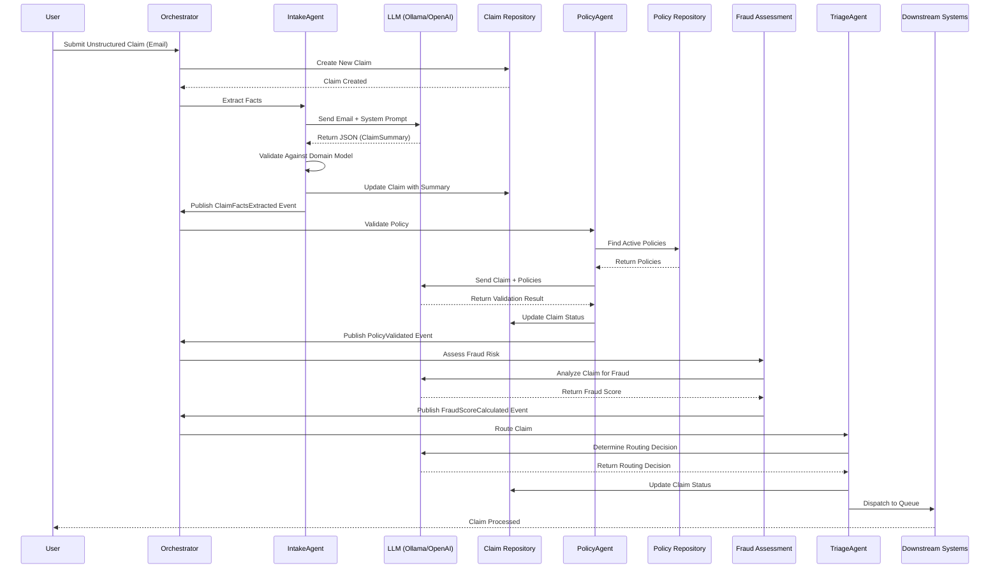

# Sequence Diagram - Claim Processing Workflow

This diagram shows the complete flow of processing a claim from unstructured input to final routing.

## Flow Explanation

1. **User submits claim** → Unstructured email/form data
2. **Orchestrator creates claim** → New Claim aggregate in DRAFT status
3. **Intake Agent extracts facts** → LLM processes unstructured data → Returns structured ClaimSummary
4. **Policy Agent validates** → Checks against active policies → Updates claim status
5. **Fraud Agent assesses** → Calculates fraud risk score
6. **Triage Agent routes** → Determines final destination → Dispatches to downstream systems

