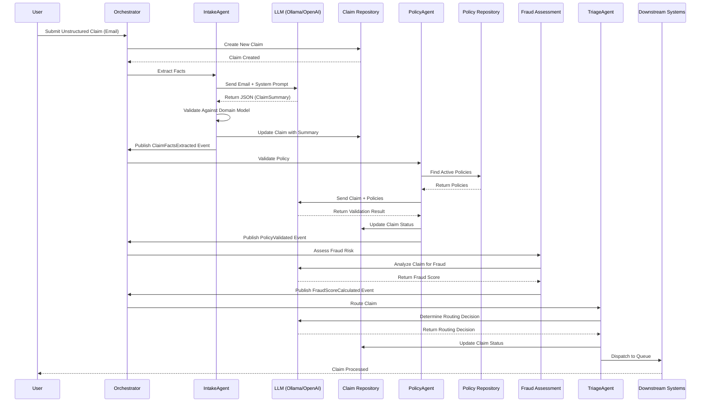

# Sequence Diagram - Claim Processing Workflow

> **⚠️ IMPORTANT**: This is a **DEMONSTRATION SYSTEM** for **EDUCATIONAL PURPOSES ONLY**.  
> **NOT for production use**. See [DISCLAIMERS.md](../DISCLAIMERS.md) for complete information.

## The Journey of a Claim: A Complete Story

Imagine you're following a package as it moves through a shipping facility. You'd see it arrive at the loading dock, get sorted, checked, routed, and finally dispatched to its destination. This sequence diagram does the same thing for a claim—it shows you the complete journey from the moment a customer submits it until it reaches its final destination.

**The Story**: Every claim starts as unstructured input—a messy email, form, or note from a customer. Like a handwritten letter, it contains all the information needed, but it's not in a format computers can easily process. Through a series of coordinated steps, specialized AI agents transform this chaos into structured, validated, and routed information. Each step adds value and moves the claim closer to resolution.

**Why This Matters**: Understanding this sequence helps you see the complete lifecycle of a claim. You'll understand dependencies (what must happen before something else can start), timing (what happens in sequence vs. parallel), and decision points (where the system makes choices). This knowledge is essential for debugging, optimization, and extending the system.

---

## Understanding the Flow

### How to Read This Diagram

Sequence diagrams read like a story from top to bottom. Each horizontal line (called a "lifeline") represents a component or actor in the system. Time flows downward, so actions at the top happen before actions at the bottom.

**The Components**:
- **User**: The person submitting the claim
- **Orchestrator**: Coordinates the entire workflow
- **Agents**: Specialized AI workers (Intake, Policy, Fraud, Triage)
- **Repositories**: Store and retrieve data (Claim, Policy)
- **LLM**: The AI model that processes requests
- **Downstream Systems**: Final destinations for processed claims

**The Arrows**: 
- Solid arrows (→) show messages or actions
- Dashed arrows (-->>) show returns or responses
- The direction shows who initiates the action

**The Flow**: Read from top to bottom, following the arrows. Notice how each step triggers the next, creating a coordinated workflow.

---

## The Complete Journey: Step by Step

### Phase 1: Claim Creation and Intake

**The Story**: A customer submits a claim—maybe an email describing an accident, a form with incomplete information, or a note with handwritten details. The system receives this unstructured input and begins the transformation process.

**What Happens**:

1. **User Submits Claim**: The journey begins when a user submits unstructured input—an email, form, or note. This is like dropping off paperwork at the front desk.

2. **Orchestrator Creates Claim**: The Workflow Orchestrator receives the input and creates a new Claim aggregate in the repository. The claim starts in DRAFT status, like a new file folder being created.

3. **Intake Agent Extracts Facts**: The Orchestrator tells the Intake Agent to extract facts from the unstructured input. The agent acts like a skilled claims analyst, reading the messy input and identifying key information.

4. **LLM Processing**: The Intake Agent sends the unstructured input plus a carefully crafted system prompt to the LLM. The prompt tells the LLM how to behave—like giving detailed instructions to a new employee.

5. **Structured Output**: The LLM returns structured JSON containing the extracted facts (claim type, date, location, amount, description). This is like the analyst writing a clean summary report.

6. **Validation**: The Intake Agent validates the LLM output against the domain model, ensuring it meets business rules. This is like a supervisor checking the report for accuracy.

7. **Claim Updated**: The validated ClaimSummary is stored in the repository, updating the claim with structured information.

8. **Domain Event Published**: The Intake Agent publishes a `ClaimFactsExtracted` domain event. This is like sending a memo to notify other departments that the first step is complete.

**Why This Matters**: This phase transforms chaos into order. Unstructured input becomes structured data that the system can process. The event-driven approach means the next phase can start as soon as facts are extracted, without the Intake Agent needing to know what happens next.

---

### Phase 2: Policy Validation

**The Story**: Now that we have structured claim facts, we need to verify that the claim is actually covered by an active insurance policy. This is like checking if someone has valid insurance before processing their claim.

**What Happens**:

1. **Event Triggers Validation**: The `ClaimFactsExtracted` event wakes up the Orchestrator, which tells the Policy Agent to start validation.

2. **Policy Lookup**: The Policy Agent queries the Policy Repository to find active policies for the claimant. This is like looking up someone's insurance in a database.

3. **Policies Retrieved**: The repository returns relevant policies, including coverage details, effective dates, and terms.

4. **LLM Validation**: The Policy Agent sends the claim details and policy information to the LLM, asking it to determine if the claim is covered. The LLM acts like a policy expert, comparing claim details against policy terms.

5. **Validation Result**: The LLM returns a validation result—covered, not covered, or needs review. This decision is based on policy terms, coverage dates, and claim details.

6. **Claim Status Updated**: The Policy Agent updates the claim status in the repository based on the validation result.

7. **Domain Event Published**: The Policy Agent publishes a `PolicyValidated` event, notifying the system that policy validation is complete.

**Why This Matters**: Policy validation ensures that only valid claims proceed. Invalid claims can be rejected early, saving processing time and resources. The event-driven approach means fraud assessment can start as soon as validation completes.

---

### Phase 3: Fraud Assessment

**The Story**: Even if a claim is covered by a policy, we need to assess the risk of fraud. This is like a security check—we want to catch suspicious patterns before processing the claim.

**What Happens**:

1. **Event Triggers Assessment**: The `PolicyValidated` event (or the original `ClaimFactsExtracted` event) triggers fraud assessment. The Orchestrator tells the Fraud Agent to assess risk.

2. **LLM Analysis**: The Fraud Agent sends the claim details to the LLM, asking it to analyze patterns, anomalies, and risk indicators. The LLM acts like a fraud investigator, looking for suspicious signs.

3. **Fraud Score**: The LLM returns a fraud score and risk level (low, medium, high), along with reasons for the assessment. This might include patterns like unusual claim amounts, suspicious timing, or inconsistent details.

4. **Domain Event Published**: The Fraud Agent publishes a `FraudScoreCalculated` event with the assessment results.

**Why This Matters**: Fraud assessment helps route claims appropriately. High-risk claims go to fraud investigation, medium-risk claims get extra review, and low-risk claims can proceed more quickly. This protects the business while maintaining efficiency.

---

### Phase 4: Triage and Routing

**The Story**: Now that we have all the information—structured facts, policy validation, and fraud assessment—we can make an intelligent routing decision. This is like a dispatcher deciding which department should handle a case.

**What Happens**:

1. **Event Triggers Triage**: The `FraudScoreCalculated` event (and potentially `PolicyValidated`) triggers the Triage Agent to make a routing decision.

2. **LLM Decision**: The Triage Agent sends all available information (claim facts, policy status, fraud score) to the LLM, asking it to determine the best routing destination.

3. **Routing Decision**: The LLM returns a routing decision based on:
   - Policy validation status (valid, invalid, needs review)
   - Fraud risk level (low, medium, high)
   - Claim complexity (simple, complex)
   - Business rules

4. **Claim Status Updated**: The Triage Agent updates the claim status in the repository with the routing decision.

5. **Dispatch**: The claim is dispatched to the appropriate downstream system:
   - **Human Review Queue**: For complex, high-risk, or ambiguous claims
   - **Automated Processing**: For simple, low-risk, valid claims
   - **Fraud Investigation**: For suspicious or high-risk claims
   - **Rejection**: For invalid claims

**Why This Matters**: Intelligent routing ensures claims go to the right place. Simple claims get fast, automated processing. Complex claims get human attention. Suspicious claims get investigation. This balances efficiency, accuracy, and risk management.

---

## Understanding the Flow: Key Patterns

### Event-Driven Architecture

Notice how components don't directly call each other—they communicate through domain events. When the Intake Agent finishes, it publishes `ClaimFactsExtracted`, and the Orchestrator listens for this event to trigger the next step. This event-driven approach (Hohpe & Woolf, 2003) keeps components loosely coupled—they don't need to know about each other directly.

**Benefits**:
- **Loose Coupling**: Components are independent and can be modified without affecting others
- **Flexibility**: New components can listen to events without modifying existing code
- **Scalability**: Events can be processed asynchronously and in parallel
- **Testability**: Components can be tested independently by publishing test events

### Domain Events as Coordination Mechanism

Domain events (Vernon, 2013) serve as the coordination mechanism between components. Each event represents something important that happened in the domain:
- `ClaimFactsExtracted`: Facts were successfully extracted
- `PolicyValidated`: Policy validation completed
- `FraudScoreCalculated`: Fraud assessment finished

These events enable the workflow to progress without components needing direct knowledge of each other.

### Agent Pattern: AI as Domain Expert

Each agent uses LLMs to act as a domain expert:
- **Intake Agent**: Acts like a claims analyst, extracting facts from unstructured input
- **Policy Agent**: Acts like a policy expert, validating coverage
- **Fraud Agent**: Acts like a fraud investigator, assessing risk
- **Triage Agent**: Acts like a dispatcher, making routing decisions

This pattern (Brown et al., 2020) enables the system to handle unstructured input intelligently while maintaining clean domain models.

### Anti-Corruption Layer

The agents act as Anti-Corruption Layers (Evans, 2003), protecting the clean domain model from messy external data. They translate unstructured input into structured domain objects, validate the results, and ensure data quality before it enters the domain.

---

## What Happens When: Decision Points and Alternatives

The sequence diagram shows the main "happy path," but the system handles many scenarios:

### Alternative Paths

**Invalid Policy**:
- If policy validation fails, the claim might be rejected immediately
- Or it might go to a review queue for human verification

**High Fraud Risk**:
- High-risk claims go to fraud investigation
- They don't proceed to normal processing

**Complex Claims**:
- Complex claims (large amounts, unusual circumstances) go to human review
- Simple claims can be processed automatically

**Policy Ambiguity**:
- If policy terms are unclear, the claim goes to human review
- A human expert makes the final decision

### Error Handling

If any step fails:
- Errors are logged and the claim status is updated
- The claim might go to an error queue for manual review
- Retry logic can attempt to reprocess failed steps
- Human reviewers can intervene when automation fails

---

## Key Takeaways

1. **The Journey is Event-Driven**: Each step publishes a domain event that triggers the next step, keeping components loosely coupled (Hohpe & Woolf, 2003).

2. **Agents Transform Data**: AI agents act as domain experts, transforming unstructured input into structured, validated information (Brown et al., 2020).

3. **Validation Happens at Each Step**: Facts are validated, policies are checked, and fraud is assessed before routing decisions are made.

4. **Intelligent Routing**: The system makes intelligent routing decisions based on all available information, balancing efficiency and risk.

5. **Human-in-the-Loop**: Complex, high-risk, or ambiguous claims go to human review, combining AI speed with human judgment.

---

## References

All concepts and patterns referenced in this document are grounded in established research:

- **Domain-Driven Design**: Evans, E. (2003). *Domain-driven design: Tackling complexity in the heart of software*. Addison-Wesley Professional.
- **Domain Events**: Vernon, V. (2013). *Implementing domain-driven design*. Addison-Wesley Professional.
- **Event-Driven Architecture**: Hohpe, G., & Woolf, B. (2003). *Enterprise integration patterns: Designing, building, and deploying messaging solutions*. Addison-Wesley Professional.
- **Large Language Models**: Brown, T., et al. (2020). Language models are few-shot learners. *Advances in neural information processing systems*, 33, 1877-1901.

For complete citations and references, see [docs/REFERENCES.md](REFERENCES.md).

---

**Remember**: This is an **educational demonstration system**. The sequence shows how claims would be processed, but a production system would require additional features like persistence, monitoring, security, and compliance. See [DISCLAIMERS.md](../DISCLAIMERS.md) for important limitations.
